# Auditoria #1228 — Fase 0: Inventário Completo do Motor Canônico

- **Status:** ativo (fotografia do estado real do código)
- **Data:** 2026-07-31
- **Escopo:** issue [#1228](https://github.com/buildea-labs/SignallQ/issues/1228) — "Centralizar métricas, contexto, diagnóstico, recomendação e resultado". Esta é a **primeira fatia** da iniciativa: auditoria, documentação e testes de caracterização. **Não altera comportamento visível.**
- **Base do código:** `main` @ `f9e5a77668eb71453d3f88ae0a7dcbebfab66a54` (após #1514 e #1515 mergeadas).
- **Relação com trabalho anterior:** esta fatia **não é o início** da Fase 0 de #1228 — ela já começou com o ADR-011 (`docs_ai/decisions/ADR-011-fase0-motor-canonico-diagnostico.md`, PR #1438) e teve uma migração parcial na PR #1467, que abriu a issue #1466 (divergência documentada entre `MetricClassifier` e `InternetDiagnosticEngine` para latência/perda/upload). Este documento **amplia** aquele trabalho para o escopo completo pedido pela issue-mãe: todos os motores, todos os contratos, todos os thresholds, todas as telas — não só Internet/Speedtest.
- **Método:** 7 auditorias paralelas (medição/normalização, diagnóstico/classificação, recomendação, apresentação/UI, persistência/PDF, contratos, topologia/gateway/fibra), cada uma lendo o código-fonte real (não apenas grep). Achados cruzados manualmente para eliminar contradições entre auditorias quando encontradas.
- **Convenção de gravidade:** P0 = risco de resultado falso ao usuário; P1 = duplicação que gera retrabalho/drift; P2 = dívida estrutural sem risco de correção imediato.
- **Atualização 2026-07-31 (Fatia 3):** **P0-9 e P0-3 corrigidos** — ver `docs_ai/decisions/ADR-012-fase3-executionid-rulesversion.md` e as seções "Fatia 3"/"Fatia 7" abaixo. `MedicaoEntity` agora carrega `executionId`/`rulesVersion` (migração Room 15→16, aditiva) e `LaudoScreen` nunca mais combina métricas de uma execução com veredito de outra. Nenhum threshold/severidade/texto foi alterado nesta fatia.

---

## Validação executada nesta fatia

O ambiente sandbox onde esta auditoria foi preparada bloqueia `dl.google.com` por política de
egress da organização (mesma limitação documentada nas PRs #1514/#1515: `./gradlew` falha ao
resolver o plugin `com.android.application` — confirmado nesta sessão com
`./gradlew :core:diagnostico:testDebugUnitTest`, erro "could not resolve plugin artifact"). Não foi
possível rodar `./gradlew test`, `./gradlew assembleDebug`, `ktlintCheck` nem `detekt` nesta sessão.

**Por isso:**
- Os testes de caracterização novos (Parte 6) foram escritos e revisados manualmente linha a linha
  contra as assinaturas reais do código de produção (lidas diretamente dos arquivos-fonte, não de
  memória), mas **não têm confirmação de compilação/execução nesta sessão**.
- Nenhum teste é declarado "aprovado" — essa confirmação depende do CI real (GitHub Actions, que
  tem acesso ao Google Maven).
- O diff desta PR foi conferido manualmente: nenhum arquivo de produção (`src/main/`) foi tocado —
  só `docs_ai/` (este documento) e `src/test/` (testes novos). Verificação: `git status --short`
  mostra somente arquivos novos (`??`), nenhum modificado.
- A PR é aberta como draft, dependendo do CI para a validação final antes de qualquer merge.

## Sumário executivo

O SignallQ já tem um objeto de consolidação real (`core/diagnostico/MetricClassifier.kt`, issue #998) e uma iniciativa declarada de migrá-lo (#1228, ADR-011). Mas a migração está **profundamente parcial**: esta auditoria encontrou

- **7 vocabulários de classificação distintos** (`MetricStatus`, `DiagnosticStatus`, `UsageProfileStatus`, `ReadinessStatus`, `VereditoUso`, `GponSaudeStatus`, `ConnectivityStatus`) mais um dormente (`DiagnosticEvaluationStatus`) e múltiplas variantes string-tipadas sem enum;
- **pelo menos 6 famílias de thresholds numéricos diferentes para latência/RSSI/bufferbloat/perda de pacotes**, espalhadas por `core/diagnostico`, `feature/speedtest`, `app/ui`;
- **2 engines de recomendação chamados literalmente `RecommendationEngine`** (`core/recommendation` e `feature/diagnostico`), mais 4 outras superfícies de recomendação (Modo Gamer, Pro, IA, worker remoto) sem catálogo compartilhado;
- **casos confirmados de mesma medição gerando conclusões diferentes na mesma tela** (ex.: latência de 120ms aparece "Bom" no card de métrica e "demorando para responder" no banner de diagnóstico da mesma `ResultadoVelocidadeScreen`);
- **nenhuma linha de `MedicaoEntity` carrega `executionId` ou `rulesVersion`** — o contrato que a issue #1228 exige como não-negociável (`executionId`, `rulesVersion`) não existe hoje em nenhuma tabela;
- **um caminho de exportação de PDF (Laudo) que pode combinar métricas de uma execução com o veredito de outra**, o mesmo padrão de bug "Frankenstein" já corrigido na Home (GH#1223) mas não replicado ao Laudo.

Nenhum destes achados foi corrigido nesta fatia — o objetivo aqui é documentar, mapear e congelar comportamento com testes de caracterização, para que a consolidação real (Fases 1+) tenha uma base de evidência.

---

# Parte 1 — Inventário de motores

## 1.1 Medição (coleta de dados brutos)

| Domínio | Componente | Arquivo | Papel |
|---|---|---|---|
| Download/Upload | `ExecutorSpeedtestCloudflare.executarFaseTransferencia`/`executarFaseUploadAdaptativa` | `feature/speedtest/.../ExecutorSpeedtestCloudflare.kt` | Multi-stream OkHttp vs. `speed.cloudflare.com`, adaptativo 2-8 streams |
| Latência | `AnalisadorAmostragemPing.analisar` | `feature/speedtest/.../AnalisadorAmostragemPing.kt` | Algoritmo compartilhado (Speedtest + tela Ping): mediana, filtro de outliers, nunca ICMP real (Android proíbe raw socket) |
| Latência (gateway) | `GatewayLatencyMeasurer` / `GatewayReachabilityProbe` | `core/network/.../GatewayLatencyMeasurer.kt`, `.../connectivity/GatewayReachabilityProbe.kt` | TCP-connect RTT nas portas 80/443/53 — **duas implementações da mesma técnica no mesmo módulo**, para propósitos diferentes (latência vs. alcançabilidade) |
| DNS | `BenchmarkDnsDoh.medirSistemaDns`/`medirProvedor` | `feature/dns/.../BenchmarkDnsDoh.kt` | DNS do sistema + DoH (RFC 8484) vs. 7 resolvedores públicos |
| Sinal Wi-Fi | `ScannerRedesWifi.escanear`, `MonitorRedeAndroid.capturarWifiLinkSnapshot` | `core/network/.../wifi/ScannerRedesWifi.kt`, `.../MonitorRedeAndroid.kt` | Scan de redes vizinhas (RSSI/BSSID/banda) + RSSI/linkspeed da rede conectada |
| Sinal móvel | `MonitorTelephonyImpl.capturarSnapshot`/`captureSimsAtivos` | `core/telephony/.../MonitorTelephonyImpl.kt` | RSRP/RSRQ/SINR via `TelephonyManager`, com fallback de 3 camadas para 5G-NSA (quirks OEM) |
| Fibra/GPON | `ExecutorFibra.executar` + `NokiaModemParser` | `feature/fibra/.../ExecutorFibra.kt`, `NokiaModemParser.kt` | Login/scrape da UI web do ONT Nokia, conversão de unidade (mW→dBm, Q8.8→°C) |
| Gateway | `GatewayLatencyMeasurer`, `GatewayReachabilityProbe`, `EquipmentClassifier` | `core/network/.../` | RTT + alcançabilidade + fingerprint de equipamento |
| Conectividade local | `ConnectivityDiagnosisEngine` + 4 `ReachabilityProbe`s (Gateway/Dns/ExternalIp/Hostname) | `core/network/.../connectivity/` | Motor local determinístico do GH#1512/PR#1514: enlace→gateway→DNS→rota externa→captive portal |
| Dispositivos | `ScannerDispositivosAndroid.executarScan` | `feature/devices/.../ScannerDispositivosAndroid.kt` | 5 fases paralelas: ping de subnet, ARP, mDNS/jmDNS, SSDP+UPnP, TCP port-probe |
| Topologia | `TopologiaRedeEngine.classificar` | `core/network/.../topologia/engine/TopologiaRedeEngine.kt` | Motor unificado (já consolidou 3 dos 4 motores originais da issue #975 — ver §1.7) |
| Dados de operadora | `ipapi.co` (MainViewModel), `ipinfo.io`/`ip-api.com` (`GeoIpResolver`), `TelephonyManager` (móvel) | `app/.../MainViewModel.kt`, `core/diagnostico/.../GeoIpResolver.kt`, `core/telephony/` | **3 mecanismos não coordenados** para resolver ISP fixo (2 HTTP + 1 via SO) e móvel — ver §1.7 e P0-6 |

## 1.2 Normalização

| Componente | Arquivo | O que normaliza |
|---|---|---|
| `SpeedtestConfig.fromModo` | `ExecutorSpeedtestCloudflare.kt:1424-1487` | Payload/streams/duração por modo (fast/complete/triplo) |
| `calcularThroughputFase` | `ExecutorSpeedtestCloudflare.kt:~1201` | Fallback de 3 camadas (janela estável → média de amostras válidas → estimativa bytes/tempo → 0), descarta 35% inicial como warm-up |
| `ValidadorBaselineLatencia` | `feature/speedtest/.../ValidadorBaselineLatencia.kt` | Remede a baseline uma vez se implausível (baseline > latência sob carga) |
| `NokiaModemParser.parseGpon`/`convertJsRxPowerToDbm` | `feature/fibra/.../NokiaModemParser.kt` | mW→dBm, Q8.8→°C, raw→V/mA; **usa `0.0` como sentinela para "não reportado"**, não `null` |
| `DetectorEnderecoIpPrivado` vs. `NatClassifier.isPrivate` | `feature/dns/...` vs. `core/diagnostico/.../topology/correlation/NatClassifier.kt` | **Duplicado**: mesma detecção de IP privado/CGNAT implementada 2x em módulos diferentes (uma IPv4+IPv6 via `InetAddress`, outra IPv4-only manual) |
| `ScanResult.paraRedeVizinha` vs. `ScanResult.toNeighbor` | `core/network/.../wifi/ScannerRedesWifi.kt` vs. `.../wifi/ScanResultAdapter.kt` | **Duas** normalizações paralelas do mesmo `android.net.wifi.ScanResult` para dois modelos diferentes (`RedeVizinha` vs. `Neighbor`), consumidores diferentes |
| `ScoreEngine.calcular` | `core/diagnostico/.../ScoreEngine.kt` | Agregação: score 0-100 ponderado por tipo de conexão, **redistribui peso** de dimensões ausentes (não zera), aplica **tetos** (nunca pisos) para métricas críticas isoladas |
| `adicionarDispositivo` | `feature/devices/.../ScannerDispositivosAndroid.kt:947-997` | Merge multi-fonte de dispositivos por MAC/IP, prioridade `ssdpXml>ssdp>mdnsJmDns>subnetMdns>arp>subnet>tcpProbe` |

## 1.3 Classificação

Ver inventário exaustivo de thresholds na **Parte 4**. Resumo dos motores:

| Motor | Arquivo | Vocabulário de saída |
|---|---|---|
| `MetricClassifier` | `core/diagnostico/.../MetricClassifier.kt` | `MetricStatus` (excelente/bom/regular/ruim/crítico/inconclusivo) — **pretende ser o canônico**, mas não é totalmente consumido |
| `SpeedtestQualityClassifier` | `feature/speedtest/.../SpeedtestQualityClassifier.kt` | `VereditoUso` (good/acceptable/poor) — família de thresholds **totalmente independente**, persiste direto em `MedicaoEntity` |
| `UsageProfileClassifier` | `core/diagnostico/.../UsageProfileClassifier.kt` | `UsageProfileStatus` (OK/Instável/Comprometido) — thresholds próprios por perfil de uso (5 perfis), nenhum reaproveita `MetricClassifier` |
| `GameReadinessClassifier` | `core/diagnostico/.../GameReadinessClassifier.kt` | `ReadinessStatus` (Bom/Atenção/Ruim) — thresholds próprios por categoria de jogo (3 categorias) |
| `ClassificadorSaudeGpon` | `core/network/.../contracts/fibra/ClassificadorSaudeGpon.kt` | `GponSaudeStatus` (boa/regular/ruim) — **fonte única real** para fibra (sem divergência encontrada) |
| `ConnectivityStatusResolver` | `core/network/.../connectivity/ConnectivityStatusResolver.kt` | `ConnectivityStatus` (9 valores) — vocabulário **desconexo** dos demais, sem ponte para `FindingEngine`/`ScoreEngine` |
| `WifiChannelDiagnosticEngine` | `core/diagnostico/.../WifiChannelDiagnosticEngine.kt` | `NivelCongestionamento` — **duas** funções de classificação independentes no mesmo arquivo; uma delas é **código morto confirmado** (sem nenhum chamador no repo) |
| `HistoricoScreen` (UI) | `app/.../ui/screen/HistoricoScreen.kt` | Classificação de download **feita na UI**, com escala própria (`>=30.0` = "bom"), diferente de `MetricClassifier` |
| `SignalBars`/`SinalTopologiaHelpers` (UI) | `app/.../ui/component/SignalBars.kt`, `.../ui/screen/SinalTopologiaHelpers.kt` | Classificação de RSSI Wi-Fi **feita na UI**, com limites `>=` inclusivos diferentes de `MetricClassifier` (`>`, exclusivo) |
| `HomeScreen` `WifiQuality` (UI) | `app/.../ui/screen/HomeScreen.kt:1900-1913` | Terceira classificação de RSSI Wi-Fi **feita na UI**, terceiro conjunto de limites |
| `UptimeChartUseCase` | `feature/history/.../UptimeChartUseCase.kt` | Classificava latência alta como `"OFFLINE"` — **rótulo enganoso**, não é ausência de conectividade. **Corrigido em GH#1518**: novo status `LATENCIA_ALTA` distinto de `OFFLINE` (reservado a ausência real de resposta) |

## 1.4 Diagnóstico

| Motor | Arquivo | Papel |
|---|---|---|
| `InternetDiagnosticEngine` | `core/diagnostico/.../InternetDiagnosticEngine.kt` | Achados `IN-NORMAL-*` (download/upload/latência/jitter/perda/bufferbloat) — **migração parcial e documentada** para `MetricClassifier` (jitter/download/bufferbloat migrados; latência/perda/upload não, ver issue #1466) |
| `WifiSignalQualityEngine` | `core/diagnostico/.../WifiSignalQualityEngine.kt` | RSSI (delega a `MetricClassifier`) + link speed e contagem de dispositivos (thresholds próprios, não em `MetricClassifier`) |
| `MobileSignalDiagnosticEngine` | `core/diagnostico/.../MobileSignalDiagnosticEngine.kt` | RSRP/RSRQ/SINR (delega `MetricClassifier`) + "qualidade %" reportada pelo Android (escala própria, sem vocabulário compartilhado) |
| `DnsDiagnosticEngine` | `core/diagnostico/.../DnsDiagnosticEngine.kt` | Thresholds inline **idênticos em valor** aos de `MetricClassifier.classificarLatenciaDns`, mas implementados separadamente — nenhuma direção migrou para a outra |
| `FibraSignalQualityEngine` | `core/diagnostico/.../FibraSignalQualityEngine.kt` | Wrapper correto sobre `ClassificadorSaudeGpon` — sem divergência |
| `HistoricalDegradationEngine` | `core/diagnostico/.../HistoricalDegradationEngine.kt` | Degradação 7d/30d — thresholds (20%/40%) reaproveitados corretamente por `UsageProfileClassifier` |
| `FindingEngine` | `core/diagnostico/.../FindingEngine.kt` | Motor de correlação: agrega achados de todos os engines acima em um achado principal + secundários, por severidade×confiança |
| `ScoreEngine`/`ScoreEvidenceBuilder` | `core/diagnostico/.../ScoreEngine.kt`, `ScoreEvidenceBuilder.kt` | Score 0-100 — `ScoreEvidenceBuilder` **reimplementa** (não reaproveita) vários thresholds do `MetricClassifier`/`InternetDiagnosticEngine`, apesar de seu próprio kdoc afirmar o contrário |
| `DiagnosticDivergenceClassifier` | `core/diagnostico/.../DiagnosticDivergenceClassifier.kt` | Modo sombra: compara diagnóstico local vs. remoto (worker) — usado por `RemoteDiagnosticRepository.evaluateShadow` |
| `ConnectivityDiagnosisEngine`/`ConnectivityStatusResolver` | `core/network/.../connectivity/` | GH#1512/PR#1514: diagnóstico de "Wi-Fi conectado sem internet", com modelo de confiança que distingue "sondagem nunca rodou" de "sondagem rodou e falhou" — único motor com esse cuidado |
| `NatClassifier` (core/diagnostico) vs. `StunNatProbe` (feature/diagnostico) | `core/diagnostico/.../topology/correlation/NatClassifier.kt`, `feature/diagnostico/.../topology/lan/StunNatProbe.kt` | **Dois classificadores de NAT independentes**, técnicas diferentes (comparação de faixa de IP vs. sondagem STUN ativa), sem contrato compartilhado — usuário pode ver "CGNAT" na tela Equipamento e "MODERADO" no Modo Gamer para a mesma rede |
| `RemoteDiagnosticReportMapper`/worker `signallq-diagnostic-worker` | `feature/diagnostico/.../remote/`, `integrations/cloudflare/signallq-diagnostic-worker/` | Reimplementação parcial em TypeScript das regras REC-01..14 (só 3 de 14 com paridade total, documentado em `docs_ai/technical/PARIDADE_REC_WORKER_2026-07-26.md`) — comparação **não cobre `recomendacoes`** no modo sombra |

## 1.5 Recomendação

**6 superfícies independentes**, sem catálogo compartilhado:

| # | Motor | Arquivo | Entrada | Saída | Status prod |
|---|---|---|---|---|---|
| 1 | `RecommendationEngine` (monetização) | `core/recommendation/.../RecommendationEngine.kt` | `RecommendationRequest` (tags/métricas/contexto) | `RecommendationDecision` | Ativo; tipos monetizados (afiliado/parceiro/operadora/ad) **hardcoded `false`** em produção — só free_tip/tutorial/configuration aparecem |
| 2 | `RecommendationEngine` (legado, REC-01..14) | `feature/diagnostico/.../RecommendationEngine.kt` | `DiagnosticInput`+`FindingResult` | `List<DiagnosticResult>` | Ativo; **nome idêntico ao #1**, tipo Kotlin diferente, sem relação de chamada entre os dois |
| 3 | `ModoGamerEngine` (dicas por categoria) | `core/diagnostico/.../ModoGamerEngine.kt` | `DiagnosticInput`+categoria de jogo | `acoes: List<String>` | Ativo; sobrepõe REC-13 (`recomendarDevicePresetGaming`) sem reconciliação |
| 4 | Recomendações do Pro (`recomendacao` por achado) | `core/diagnostico/.../DiagnosticResult.recomendacao` | achados rule-level | string simples | Ativo no Pro; Pro **nunca** recebe REC-01..14 (parâmetro omitido no `DiagnosticRunner.run()` do Pro) — Pro mostra texto de recomendação **estruturalmente diferente** do Consumer para o mesmo tipo de achado |
| 5 | IA (`acoesRecomendadas`) | `integrations/cloudflare/ai-diagnosis-worker/src/index.ts` | contexto de diagnóstico + achados locais | texto livre (até 3 ações) | Ativo; **não restrito a nenhum catálogo**, pode sugerir ação ausente de #1/#2/#3 |
| 6 | `signallq-diagnostic-worker` (TS, paridade parcial) | `integrations/cloudflare/signallq-diagnostic-worker/src/bundled-ruleset.ts` | mesmo `DiagnosticSnapshot` | `recomendacoes` (formato REC) | Presente em `evaluate()` mas **não é o caminho de produção** (produção usa `evaluateShadow()`, local-autoritativo) |

Ponte crítica: `RecommendationRequestMapper.mapTags()` (`feature/diagnostico/.../RecommendationRequestMapper.kt:86-135`) **não lê a saída de #2** (REC-01..14) — deriva tags independentemente por prefixo de ID de achado bruto, com regras de exclusão diferentes das de #2. Isso permite que #1 e #2 divirjam para o mesmo diagnóstico (ver P0-2).

## 1.6 Apresentação

| Tela/componente | Delega corretamente? | Observação |
|---|---|---|
| `ResultadoVelocidadeScreen.kt` | **Não, parcialmente** | Banner vem de `FindingEngine`/`InternetDiagnosticEngine`; os 5 cards de métrica recalculam via `MetricClassifier` diretamente no Composable — duas fontes para a mesma tela (ver P0-1) |
| `HistoricoScreen.kt` | **Não, parcialmente** | `bufferbloatVeredito` reclassifica corretamente via `MetricClassifier`; classificação de download é feita com escala própria (`>=30.0`); existe classificador morto (`qualidadeLabel`/`qualidadeColor`, `@Suppress("unused")`) no mesmo arquivo |
| `SinalScreen.kt`/`SignalBars.kt`/`SinalTopologiaHelpers.kt` | **Não** | RSSI Wi-Fi classificado 2x na UI com limites `>=` diferentes do canônico `MetricClassifier` (`>`), que só é usado pelo motor de diagnóstico (não pela UI) |
| `HomeScreen.kt` (`WifiFactorsSection`) | **Não** | Terceira classificação de RSSI (própria), e o fator "congestionamento de canal" está **hardcoded como sempre bom**, nunca reflete dado real |
| `SinalMovelClassificacao.kt` | **Sim** | Delega a `MetricClassifier.classificarRsrp/Rsrq/Sinr` (migrado em GH#1206) — **padrão correto**, contraste positivo com o caso Wi-Fi |
| `DiagnosticoGuiadoScreen.kt`, `ModoGamerScreen.kt` | **Sim** | Renderizam resultado do engine (`DiagnosticoGuiadoEngine`/`ModoGamerEngine`) as-is |
| `DiagnosticoStatusBanner` (`DiagnosticoResultadoComponents.kt`) vs. `EquipamentoModuloTecnicoCard` vs. `LocalDeviceSection` vs. `LaudoScreen` | **Não** | 4 mapeamentos independentes de `DiagnosticStatus`→cor; `attention` é **vermelho** (mesmo peso visual que `critical`) em um componente e **laranja** nos outros 3 |
| `LaudoScreen.kt` (Laudo compartilhado) | **Não** | Combina `ultimaMedicao` (última linha do Room) com `snapshotDiagnostico` (estado ao vivo) **sem checar se pertencem à mesma execução** — `executionId` hardcoded para `""` |
| `UptimeChartUseCase`/`UptimeGridChart` (feature/history) | **Não** | Thresholds próprios de latência (300/800ms) inteiramente desconexos de `MetricClassifier` (unificação é escopo separado, issue #1466). O bucket "offline" que na verdade significava "latência alta" foi **corrigido em GH#1518** (novo status `LATENCIA_ALTA`) |
| `DetalhesTecnicosScreen.kt` | **Sim (por design)** | Mostra dado bruto, sem veredito |
| `ExportadorHistoricoPDF`/`CSV` | **N/A** | Não recalculam, mas **omitem** as colunas de classificação já persistidas (gap de completude, não de correção) |

## 1.7 Persistência e exportação

Ver detalhamento completo na Parte 2. Resumo:

- `MedicaoEntity` (`core/database`, tabela `medicao`, schema v15): guarda valores brutos **e** classificados (enum-as-string), mas **sem `executionId` nem `rulesVersion`**.
- `ConnectivityDiagnosisHistoryEntity` (schema v15, GH#1512): único exemplo limpo no código — guarda só valor avaliado/sanitizado, nunca IP/SSID/DNS brutos.
- `RecommendationHistoryEntity`: sem FK para `MedicaoEntity`.
- `core/relatorio`: motor de PDF genérico (HTML→PDF via WebView), sem modelo de domínio — quem monta o HTML é responsabilidade do chamador.
- Dois pipelines de PDF no app consumer: `ResultadoPdfGenerator` (consistente, só estado ao vivo) e `LaudoScreen.gerarECompartilharLaudo` (risco de mistura de execuções, ver P0-3).
- `feature/history`'s `ExportadorHistoricoPDF`/`CSV`: exportam só campos brutos, omitem classificação.
- `signallq-diagnostic-worker`: `rulesetVersion`/`engineVersion`/`resultSchemaVersion` existem no contrato remoto (TypeScript) e num tipo Kotlin órfão (`DiagnosticEvaluation.kt`, nunca plugado), mas nunca chegam a `MedicaoEntity` nem à UI.
- Telemetria Firebase: `ia_laudo_*` eventos carregam `schema_version`/`prompt_version`, mas isso versiona o **prompt de IA**, não o motor de classificação local.

### Estado do #975 (topologia Wi-Fi) — relacionado, não escopo desta fatia

Dos 4 motores originais de #975: `TopologiaWifiEngine`+`GatewayHeuristica`+`MeshOuiDatabase` **já foram consolidados** em `TopologiaRedeEngine`+`OuiCatalog` (Fase 2C/#981). `ClassificadorDispositivoRede` (feature/devices) e `MeshDetector`+`TopologyDiagnostic` (feature/diagnostico, com seu próprio 4º catálogo OUI) **continuam independentes** — só existe uma camada de correlação pós-hoc (#983) entre eles, não uma fusão de lógica.

---

# Parte 2 — Tabela de rastreabilidade

| Dado/decisão | Origem | Normalizador | Classificador | Diagnóstico | Recomendação | UI | Histórico | PDF | Observações |
|---|---|---|---|---|---|---|---|---|---|
| **Download** | `ExecutorSpeedtestCloudflare` | `calcularThroughputFase` (fallback 3 camadas) | `MetricClassifier.classificarDownload` (canônico) **+** `SpeedtestQualityClassifier` (independente, `VereditoUso`) | `InternetDiagnosticEngine` IN-NORMAL-03 (migrado p/ `MetricClassifier`, coincide em 25.0) | REC-04/REC-13 usam raw; `core/recommendation` via tags | `ResultadoVelocidadeScreen` recalcula via `MetricClassifier`; `HistoricoScreen` usa escala própria `>=30.0` (P0-1) | `MedicaoEntity.downloadMbps` (raw) | `ExportadorHistoricoPDF` exporta raw só | **Divergência confirmada**: mesmo valor pode ser "bom" na Home/Histórico e "regular" no Resultado |
| **Upload** | `ExecutorSpeedtestCloudflare` (adaptativo, retry 3x) | idem download | `MetricClassifier.classificarUpload` (1/3/10/20 Mbps) **vs.** `InternetDiagnosticEngine` (cliff 5.0 Mbps, não migrado) | IN-NORMAL-04/04Z — thresholds próprios, issue #1466 | REC-04 usa raw vs `linkSpeed` | Card do Resultado usa `MetricClassifier`; banner usa engine (100% divergente em 3-10 Mbps) | `MedicaoEntity.uploadMbps` (raw) | raw só | **Divergência documentada (#1466)** |
| **Latência** | `AnalisadorAmostragemPing` (mediana, filtro outlier) | — | `MetricClassifier.classificarLatencia` (`<100/`<=150`/`<=200`) **vs.** `InternetDiagnosticEngine` (`>100.0` excl., issue #1466) **vs.** `UsageProfileClassifier`(4 perfis, 4 escalas) **vs.** `GameReadinessClassifier`(3 categorias) **vs.** `SpeedtestQualityClassifier` **vs.** `UptimeChartUseCase` (300/800ms; rotulava alto como "OFFLINE", **corrigido em GH#1518** p/ `LATENCIA_ALTA` — thresholds numéricos 300/800ms permanecem desconexos dos demais, unificação é escopo de #1466) | `InternetDiagnosticEngine` IN-NORMAL-05 | REC-07 usa `>100.0` (bate c/ engine, não c/ classifier) | Card `ResultadoVelocidadeScreen` mostra "Bom" a 120ms; banner da mesma tela diz "demorando p/ responder" (P0-1, mesma tela) | `MedicaoEntity.latencyMs` (raw) | raw só | **≥6 escalas numéricas diferentes para a mesma grandeza** |
| **Jitter** | `AnalisadorAmostragemPing` | mean(abs(delta)) | `MetricClassifier.classificarJitter` (`<5/<=10/<=20`) — bem reconciliado c/ `InternetDiagnosticEngine`/REC-05 | IN-NORMAL-06 (migrado, coincide) | REC-07 (`>20.0`, coincide) | Reconciliado | raw | raw | Métrica com **menor** divergência |
| **Perda de pacotes** | `AnalisadorAmostragemPing` (timeouts/total, full double) | `packetLossSource="estimated"` (hardcoded, não é perda real de pacote ICMP) | `MetricClassifier` (`<0.5/<=2.0`) **vs.** `InternetDiagnosticEngine`(`>=1.0/>=3.0`, issue #1466) **vs.** `ScoreEvidenceBuilder` (override manual 1.0/3.0) **vs.** `UsageProfileClassifier`/`GameReadinessClassifier` (`>=1.0` medida real) | IN-NORMAL-07/07b | REC-11 (`<1.0`, bate c/ engine) | Card mostra "Regular" a 1.5%; achado já disparou "attention" a 1.0% | raw | raw | **Divergência documentada (#1466)** + reimplementação extra no `ScoreEvidenceBuilder` |
| **Bufferbloat** | `max(latSobCarga - baseline, 0)` | — | `MetricClassifier` = `SpeedtestQualityClassifier` (5/30/100ms, **valores idênticos, 2 implementações separadas**) | IN-NORMAL-09/09b (migrado, idêntico) | REC-05 (`<=30`/`>100`, coincide) | `HistoricoScreen.bufferbloatVeredito` reclassifica corretamente via `MetricClassifier` a cada leitura — mas `gargaloPrimario` persistido veio da **outra** implementação (`SpeedtestQualityClassifier`) | `MedicaoEntity.bufferbloatMs` (raw), `gargaloPrimario` (classificado, via cópia separada) | raw só | Hoje sem divergência numérica, mas **split-brain latente**: se qualquer cópia mudar, histórico reclassifica com regra nova enquanto `gargaloPrimario` já persistido reflete a regra antiga, sem versão para detectar |
| **DNS (latência)** | `BenchmarkDnsDoh` (mediana, 6 rounds, descarta round0) | `combinarResultados`/`calcularMediana` | `MetricClassifier.classificarLatenciaDns` (`<=50/<=150/<=300`) **vs.** `DnsDiagnosticEngine` (mesmos números, implementação separada, direção de migração nunca invertida) | DNS-01/02/03 | REC-06 (`<=50`, coincide) | — | raw | raw | Números batem, mas **2 fontes de verdade** para a mesma tabela |
| **Wi-Fi (RSSI)** | `ScannerRedesWifi`/`MonitorRedeAndroid` | Sanitização de BSSID/SSID placeholder | `MetricClassifier.classificarRssiWifi` (canônico, por banda, `>` excl.) **vs.** `SignalBars.signalColor` **vs.** `SinalTopologiaHelpers.signalQuality` **vs.** `HomeScreen.WifiQuality` (3 implementações de UI, `>=` incl., limites diferentes) | `WifiSignalQualityEngine` (delega ao canônico) | REC-04(`>=-60`/`>=-65` incl., conflita c/ canônico no boundary)/REC-07(`<-70`)/REC-08(`>=-67`) — **4 cortes RSSI diferentes só neste arquivo** | **-65dBm em 5GHz é "Bom"(verde) na tela Sinal e "attention"(achado) no motor de diagnóstico simultaneamente** | raw | raw | `MetricClassifier`'s próprio kdoc admite: "SinalScreen.kt ainda não foi migrado" |
| **Rede móvel (RSRP/RSRQ/SINR)** | `MonitorTelephonyImpl` | sentinela `Int.MAX_VALUE`→`null`, fallback 3 camadas p/ 5G-NSA | `MetricClassifier.classificarRsrp/Rsrq/Sinr` (canônico) — **corretamente** usado por `MobileSignalDiagnosticEngine` e `SinalMovelClassificacao.kt` (UI) | `MobileSignalDiagnosticEngine` (pior-de-três) + "qualidade %" Android (escala própria, sem vocabulário compartilhado) | REC-10 delega ao canônico (consistente) | `SinalMovelClassificacao.kt` delega corretamente | raw | raw | **Único domínio de sinal com migração completa e consistente** — modelo do que #1228 deve replicar para Wi-Fi |
| **Fibra (RX/TX/temp GPON)** | `NokiaModemParser` (mW→dBm, com sentinela `0.0`) | `ClassificadorSaudeGpon` (worst-of-3) | `ClassificadorSaudeGpon` (fonte única real) **vs.** `NokiaG1425GBProfile`/`ClassificadorOpticoNokiaG1425GB` (perfil vendor-specific, **órfão, sem chamador em produção**, mas com thresholds materialmente diferentes p/ o mesmo RX) | `FibraSignalQualityEngine` (delega corretamente) | REC-09 | `EquipamentoPanelMapper` delega corretamente | raw | raw | O arquivo órfão (`NokiaG1425GBProfile`) cita #1228 explicitamente no próprio kdoc como candidato a consolidação — bomba-relógio se for ativado sem reconciliar |
| **Gateway (RTT/alcançabilidade)** | `GatewayLatencyMeasurer` + `GatewayReachabilityProbe` (2 implementações da mesma técnica TCP-connect) | — | sem classificação de severidade dedicada; usado como evidência | `ConnectivityDiagnosisEngine` (camada "gateway" do fluxo #1512) | REC-08 (`>=-67` RSSI + `<=50` RTT, thresholds próprios) | Presenter dedicado (`ConnectivityDiagnosisPresenter`) | `ConnectivityDiagnosisHistoryEntity` (só resultado avaliado) | não incluído no Laudo | `GatewayLatencyMeasurer` documentadamente **não é persistido** (decisão de design) |
| **Internet validada** | `MonitorRedeAndroid.calcularSnapshotAtual` (`NET_CAPABILITY_VALIDATED`) | retry 1x p/ captive-portal-friendly | `ConnectivityStatusResolver` (9 valores) | `ConnectivityDiagnosisEngine` (GH#1512) | — | `ConnectivityDiagnosisPresenter` (textos por status, calibrados por confiança) | `ConnectivityDiagnosisHistoryEntity` | não incluído no Laudo | Vocabulário `ConnectivityStatus` é **totalmente desconexo** de `DiagnosticStatus`/`MetricStatus` — sem ponte para `FindingEngine`/`ScoreEngine` |
| **Captive portal** | `NetworkCapabilities.NET_CAPABILITY_CAPTIVE_PORTAL` | — | `ConnectivityStatusResolver` (precedência sobre outras evidências) | `ConnectivityDiagnosisEngine` | ação sugerida "abrir portal" | `ConnectivityDiagnosisPresenter` | `ConnectivityDiagnosisHistoryEntity` | não incluído | Coberto por testes de caracterização de `ConnectivityStatusResolverTest` (PR #1514) |
| **Conectividade parcial** | combinação de sondas parciais | `globalTimeoutExceeded` flag distingue "não sondado" de "sondado e falhou" | `ConnectivityStatusResolver.PARTIAL_CONNECTIVITY` | `ConnectivityDiagnosisEngine` | — | `ConnectivityDiagnosisPresenter` | `ConnectivityDiagnosisHistoryEntity` | não incluído | Único motor com honestidade explícita sobre evidência ausente vs. evidência negativa |
| **Operadora (fixa/móvel)** | 3 fontes não coordenadas: `ipapi.co` (MainViewModel), `ipinfo.io`/`ip-api.com` (`GeoIpResolver`), `TelephonyManager` (móvel) | `BancoOperadoras.resolver`(fixa, regex `\b`)/`resolverMovel`(móvel, prefixo, só 3/18 operadoras mapeadas) | `OperadoraDirectoryResolver` (contrato compartilhado `ResolvedOperadoraIdentity`, mas **lógica de match interna bifurcada**) | não entra no `FindingEngine` | — | `OperadoraBottomSheet` | `IspInfoCache` (memória, não persistido em Room) | não incluído | **Risco nomeado explicitamente pela própria #1228**: "operadora móvel substituir ou concorrer com a fixa" — confirmado estruturalmente |
| **Equipamento local** | `LocalNetworkDeviceSnapshot` (drivers Nokia/TP-Link) | `LocalDeviceSafeFilter` (única allowlist real do código para dado sensível) | `DeviceType`/`SupportLevel` (contracts/gateway) **duplicados 1:1** por `DeviceType`/`SupportLevel` (contracts/localdevice) — 2 tipos Kotlin distintos, sem conversor | `FindingEngine` (via `confiancaEquipamentoLocal`, desconto por `SupportLevel`) | REC-04/08 usam raw diretamente | `LocalDeviceSection`, `EquipamentoPanelMapper` | não persistido estruturado (só via `MedicaoEntity.diagnosticoTexto`) | Laudo usa via `decisao` | Cópia usada por 10-12 arquivos (localdevice) vs. quase-morta (gateway, 2-3 arquivos) — candidato barato a dedup |
| **Topologia (papel do nó)** | `TopologiaRedeEngine` (consolidado #975 Fase2C) | evidência ponderada OUI+banda+SSID | `ClassificacaoTopologia`/`PapelTopologia` | não entra no `FindingEngine` diretamente | `RecommendationEngine`(feature/diagnostico) consome via BSSID | Home, Sinal | não persistido estruturado | não incluído | **Consolidação parcial de #975**: este domínio está OK, mas `MeshDetector`/`TopologyDiagnostic` (diagnóstico profundo) ainda usa 4º catálogo OUI independente |
| **Dispositivos (tipo)** | `ScannerDispositivosAndroid` (5 fontes fundidas) | `NamingPrioridade`, `MacAddressUtil.ehLocalmenteAdministrado` | `ClassificadorDispositivoRede` (feature/devices, **não consolidado** com #975) | não entra no `FindingEngine` | REC-04 conta dispositivos (`>10`, mesmo corte que `FindingEngine.MUITOS_CLIENTES_THRESHOLD`) | `DispositivosScreen` | `ApelidoDispositivoEntity` (só apelido, não classificação) | não incluído | Enum canônico alvo (`TipoDispositivoRede`, core/network) já existe mas **nada emite para ele ainda** |

---

# Parte 3 — Mapa de contratos

## 3.1 Correção de premissa: `io.veloo` vs `io.signallq`

Verificado exaustivamente (scan de `package` real de todo `.kt` do repo, não caminho de diretório): **756 arquivos declaram `io.signallq...`, zero declaram `io.veloo...`**. Não há colisão de namespace em tempo de compilação. O que existe é **drift de diretório**: ~50% dos contratos de `core/network`, a maior parte de `core/database` e o grosso de todo `feature/*` ainda residem fisicamente em `src/main/kotlin/io/veloo/app/...` apesar do `package` já dizer `io.signallq.app...`. Isso já está registrado como risco conhecido em `docs_ai/ARQUITETURA/README.md` §6 ("Riscos e mitigação") — não é achado novo desta auditoria, mas relevante porque **invalida qualquer busca "por diretório" durante a consolidação de #1228**: só o `package` real é confiável.

## 3.2 Contratos por módulo

### `core/network/contracts/` (Kotlin puro, zero `android.*`/Compose confirmado)

| Pacote | Contrato | Papel | Observação |
|---|---|---|---|
| `contracts.connectivity` | `ConnectivityDiagnosis`, `ConnectivityStatus`(9), `ProbeResult`(sealed) | Diagnóstico de conectividade local (#1512/PR#1514) | `ProbeResult` é **persistência lossy**: só o nome do case sealed é salvo (`.toString()`), `elapsedMs`/`reason` são descartados |
| `contracts.gateway` | `DeviceType`(5), `SupportLevel`(4), `EquipmentClassification`, `EquipmentFingerprintEvidence` | Fingerprint de equipamento (login/modelo) | `DeviceType`/`SupportLevel` **duplicados 1:1** em `contracts.localdevice` — dois tipos Kotlin distintos, mesmos valores, sem conversor |
| `contracts.localdevice` | `LocalNetworkDeviceSnapshot`, `DeviceType`(5, duplicado), `SupportLevel`(4, duplicado), `LocalDeviceSafeFilter`, `LocalDeviceSectionStatus`(4) | Leitura completa do equipamento (fibra/wan/lan/wifi/clientes) | `LocalDeviceSafeFilter` é a única allowlist real de dado sensível→IA/analytics/log no código |
| `contracts.fibra` | `GponSaudeStatus`(3), `ClassificadorSaudeGpon` | Saúde óptica GPON | Sem divergência — modelo de boa consolidação |
| `contracts.topologia` | `ClassificacaoTopologia`, `PapelTopologia`(6), `NivelConfianca`(3, ALTA/MEDIA/BAIXA) | Resultado do motor de topologia | `NivelConfianca` reutilizado corretamente por `connectivity`/`wifi.channel` — bom precedente de reuso |
| `contracts.oui` | `OuiEntry`, `NivelValidacaoOui`(2) | Catálogo OUI unificado (#975/#978) | Seu próprio kdoc documenta a própria história de deduplicação — modelo a seguir para #1228 |
| `contracts.dispositivo` | `TipoDispositivoRede` | "Superset canônico" planejado p/ substituir `feature/devices.TipoDispositivo` | Ainda não emitido por nada (issue #975 Fase 3+) |
| `contracts.wifi` | `RedeVizinha`, `SegurancaWifi` | Rede Wi-Fi vizinha (scan) | Paralela a `core/diagnostico.RedeWifiVizinha` (campos parecidos, não idênticos) |

### `core/diagnostico/` (Kotlin puro, zero `android.*`/Compose confirmado)

| Contrato | Papel | Observação |
|---|---|---|
| `DiagnosticInput` (+8 sub-inputs) | Entrada unificada de todo motor de diagnóstico | Bem consolidado — ponto de entrada único real |
| `DiagnosticResult` | Um achado (98 usos no código) | — |
| `DiagnosticStatus`(5) | Vocabulário de `DiagnosticResult.status` | 1 de 7+ vocabulários de severidade (ver §3.4) |
| `DiagnosticReport` | Relatório agregado de uma execução | `veredito` é *computed property*, não persistido — 3º vocabulário (Excelente/Bom/Regular/Fraco) |
| `DiagnosticEvaluation` (+5 enums) | Espelho Kotlin do envelope TS do worker remoto (ADR-011) | **Órfão**: nunca plugado em nenhum mapper, produção não o usa |
| `MetricStatus`(6) | Vocabulário do `MetricClassifier` | Pretende ser canônico, kdoc avisa explicitamente que não é intercambiável com `UsageProfileStatus`/`DiagnosticStatus` |

### `core/recommendation/` (Kotlin puro, zero dependências além de JUnit)

`Recommendation`, `RecommendationDecision`, `RecommendationRequest`+`RecommendationFlags`, `RecommendationType`(7), `DiagnosticTag` (value class), `NetworkContextType`(3) — **duplicado** de `core/diagnostico.ConnectionType`(5), mapeamento manual colapsa `desconectado`/`desconhecido` silenciosamente em `WIFI`. `DiagnosticMetrics`+`DeviceContext` — 3º shape quase-idêntico a `InternetDiagnosticInput` e `AiMetricasAtuais`.

### `core/database/` (Room)

`MedicaoEntity` (raw+classificado, sem `executionId`/`rulesVersion`), `ConnectivityDiagnosisHistoryEntity` (só classificado, exemplo limpo), `RecommendationHistoryEntity` (sem FK), `ChatSessionEntity`/`ChatMessageEntity` (`diagnosisId` é FK por valor, não por constraint Room).

### `feature/diagnostico/ai/AiModels.kt`

`DiagnosisAiContext`+`AiDiagnosisResult`+`AiAcaoRecomendada` — **3º shape de "recomendação"** paralelo. Introduz mais 3 vocabulários string-tipados (não-enum): `AiDiagnosisResult.status`, `ClassificacaoItem.avaliacao`, `AiImpacto.*`.

## 3.3 Achado central: `DeviceType`/`SupportLevel` duplicados de verdade

Único caso de **duplicação estrutural real** encontrado (nome idêntico, shape idêntico, dois tipos Kotlin distintos): `contracts.gateway.DeviceType`/`SupportLevel` vs. `contracts.localdevice.DeviceType`/`SupportLevel`. Uso assimétrico (gateway: 2-3 arquivos quase-morto; localdevice: 10-12 arquivos, carrega peso real) — candidato de baixo risco/alto valor para a Fase 1+.

## 3.4 Achado central: proliferação de vocabulários de severidade

| Vocabulário | Valores | Dono | Escopo |
|---|---|---|---|
| `DiagnosticStatus` | ok/info/attention/critical/inconclusive (5) | core/diagnostico | achado individual |
| `DiagnosticEvaluationStatus` | OK/ATTENTION/CRITICAL/INCONCLUSIVE (4, wire) | core/diagnostico | envelope remoto (órfão) |
| `MetricStatus` | excelente/bom/regular/ruim/crítico/inconclusivo (6) | core/diagnostico | métrica bruta |
| `UsageProfileStatus` | OK/Instável/Comprometido (3) | core/diagnostico | perfil de uso |
| `ReadinessStatus` | Bom/Atenção/Ruim (3) | core/diagnostico | prontidão p/ jogos |
| `GponSaudeStatus` | boa/regular/ruim (3) | core/network | saúde óptica |
| `LocalDeviceSectionStatus` | OK/ATENCAO/INDISPONIVEL/NAO_SUPORTADO (4) | core/network | seção do painel de equipamento |
| `ConnectivityStatus` | 9 valores | core/network | camada de conectividade |
| `MeasurementStatus` | COMPLETE/PARTIAL/INCONCLUSIVE/CONTAMINATED/CANCELLED (5) | feature/speedtest | integridade da execução |
| `VereditoUso` | good/acceptable/poor (3) | feature/speedtest | qualidade p/ uso |
| `MedicaoEntity.status: String` | "completed"/"failed"/"partial"/"timeout"/"contaminated"/"inconclusive" (6, **não tipado**) | core/database | status persistido — **não bate 1:1 com `MeasurementStatus`** |
| `AiDiagnosisResult.status: String` | "bom"/"regular"/"critico"/"inconclusivo" (4, não tipado) | feature/diagnostico (IA) | veredito da IA |
| `ClassificacaoItem.avaliacao: String` | "boa"/"regular"/"ruim"/"inconclusiva"/"nao_avaliado" (5, não tipado) | feature/diagnostico (IA) | classificação por dimensão |
| `AiImpacto.*: String` | valores livres (não tipado) | feature/diagnostico (IA) | impacto por caso de uso |
| `DiagnosticReport.veredito` (computed) | Excelente/Bom/Regular/Fraco (4) | core/diagnostico | faixa de score |

O próprio `MetricClassifier.kt` (kdoc) inclui uma tabela manual de mapeamento entre `MetricStatus` e `UsageProfileStatus` com o aviso "nunca automatize essa conversão sem contexto" — **admissão explícita, no próprio código, de que uma escala canônica de severidade ainda não existe.**

---

# Parte 4 — Inventário de thresholds

Tabela condensada — thresholds numéricos coincidentes omitidos quando já cobertos acima; foco em **divergência real** (mesma grandeza, cortes diferentes).

| Métrica | Arquivo | Regra | Unidade | Resultado | Consumidores | Duplicado? | Divergência? |
|---|---|---|---|---|---|---|---|
| Latência | `MetricClassifier.kt:82-87` | `<100/<=150/<=200` | ms | excelente..ruim (sem crítico) | motor de diagnóstico Wi-Fi/móvel, cards de UI | — | canônico pretendido |
| Latência | `InternetDiagnosticEngine.kt:128` | `>100.0` (excl.) | ms | attention | banner `ResultadoVelocidadeScreen` | Sim (2 fontes) | **Sim — issue #1466, na mesma tela que o de cima** |
| Latência | `UsageProfileClassifier.kt` (4 perfis) | `<=80/150`(Navegação), `<=50/100`(Jogos), `<=80/150`(Videochamada), `<=100/180`(Trabalho) | ms | OK/Instável/Comprometido | aba "perfil de uso" | Sim | Sim (intencional, mas não documentado como tal fora do próprio kdoc) |
| Latência | `GameReadinessClassifier.kt` (3 categorias) | `<=50/100`(FPS), `<=50/80`(Cloud), `<=60/120`(Mobile) | ms | Bom/Atenção/Ruim | aba "prontidão p/ jogos" | Sim | Sim (intencional) |
| Latência | `SpeedtestQualityClassifier.kt` | `<=200/500`(streaming), `<=50/100`(gamer), `<=80/150`(video) | ms | good/acceptable/poor | `MedicaoEntity.vereditoStreaming/Gamer/VideoChamada` | Sim | Sim (persistido, nunca reclassificado) |
| Latência | `UptimeChartUseCase.kt:30-31` | `<=300 OK`, `<=800 LENTO`, `>800 LATENCIA_ALTA` (era rotulado `OFFLINE`) | ms | rótulo corrigido p/ `LATENCIA_ALTA`; `OFFLINE` reservado a ausência real de resposta | tela Histórico/Uptime | Sim | **Corrigido em GH#1518** (rótulo enganoso, era P0). Thresholds numéricos 300/800ms seguem desconexos dos demais — unificação é escopo de #1466 |
| Perda de pacotes | `MetricClassifier.kt:96-101` | `<=0/0.5/2.0` | % | excelente..ruim | canônico pretendido | — | — |
| Perda de pacotes | `InternetDiagnosticEngine.kt:63,79` | `>=1.0/3.0` | % | attention/critical | banner | Sim | **Sim — issue #1466** |
| Perda de pacotes | `ScoreEvidenceBuilder.kt:177-179` | `>=1.0/3.0` override manual | % | pontuação | Score 0-100 | Sim | Sim (reimplementa em vez de chamar o canônico, apesar do próprio kdoc afirmar o contrário) |
| Upload | `MetricClassifier.kt:177-183` | `>=20/10/3/1` | Mbps | excelente..crítico | canônico pretendido | — | — |
| Upload | `InternetDiagnosticEngine.kt:176,190` | `==0.0 critical`, `<5.0 attention` | Mbps | crítico/attention | banner | Sim | **Sim — issue #1466** |
| Upload | `ScoreEvidenceBuilder.kt:92-97` | `<=0→15, <5.0→55, else 100` | Mbps | pontuação | Score | Sim | Sim (bate com o engine, não com o canônico) |
| Bufferbloat | `MetricClassifier.kt:202-207` = `SpeedtestQualityClassifier.kt:9-14` | `<5/30/100` | ms | idêntico | canônico + persistido | Sim (2 impls, valores iguais) | Não hoje — **latente** (ver Parte 2) |
| Bufferbloat | `GameReadinessClassifier.kt` (Cloud Gaming) | `<=30/80` | ms | Bom/Atenção/Ruim | aba jogos | Sim | **Sim — único ponto onde bufferbloat diverge numericamente (80 vs. 100)** |
| Wi-Fi RSSI (5GHz) | `MetricClassifier.kt:59-74` | `>-55/-65/-75/-82` (excl.) | dBm | excelente..crítico | motor de diagnóstico | — | canônico pretendido |
| Wi-Fi RSSI (5GHz) | `SignalBars.kt:64-77`, `SinalTopologiaHelpers.kt:157-172`, `HomeScreen.kt:1907-1913` | `>=-65/-75` (incl.), 3 implementações diferentes | dBm | cor/label na UI | Sinal, Home | Sim (3 impls) | **Sim — mesmo -65dBm é "Bom" na UI e "attention" no motor, ver P0** |
| Wi-Fi RSSI | `RecommendationEngine.kt` (REC-04/07/08) | `>=-60/-65`(REC-04, incl.), `<-70`(REC-07), `>=-67`(REC-08) | dBm | 4 cortes diferentes no mesmo arquivo | recomendações práticas | Sim | Sim — nenhum bate com o canônico nem é sensível a banda em 2 dos 3 casos |
| Wi-Fi RSSI (stale doc) | `MovelSnapshot.kt:17-20` (kdoc) | `>-85/-100/-110` | dBm | bom/médio/ruim/péssimo | nenhum (kdoc desatualizado) | — | Já sinalizado pelo próprio `MetricClassifier.kt:106` como "NÃO usar" |
| DNS latência | `MetricClassifier.kt:189-194` = `DnsDiagnosticEngine.kt:15-48` | `<=50/150/300` | ms | idêntico | canônico + achados DNS-01/02/03 | Sim (2 impls, valores iguais) | Não numericamente, mas 2 fontes de verdade |
| GPON RX/TX/temp | `ClassificadorSaudeGpon.kt` | RX `>=-23/-27`; TX `[0.5,5.0]/-1`; temp `<65/75` | dBm/°C | boa/regular/ruim | fibra | — | canônico, sem divergência |
| GPON RX/TX (órfão) | `NokiaG1425GBProfile.kt:59-83` | RX fora-especificação se `<-27 ou >-8` | dBm | fora/próximo/dentro | nenhum (código morto) | Sim | **Sim — RX=-25 é "regular" no ativo e "sem problema" no órfão; kdoc cita #1228 diretamente** |
| Devices no Wi-Fi | `WifiSignalQualityEngine.kt:168,179` | `>10 info`, `>20 attention` | contagem | 2 níveis | achado Wi-Fi | Sim | não numericamente — |
| Devices no Wi-Fi | `FindingEngine.kt:12` / `RecommendationEngine.kt:245` | `>10` | contagem | 1 nível | correlação + REC-04 | Sim | mantido em sync por comentário (não por constante compartilhada) |
| Congestão de canal | `WifiChannelDiagnosticEngine.kt:267-275` | `>-40/-60` (score dBm-equiv) | — | congestionado/moderado/livre | wired à UI (espectro) | — | ativo |
| Congestão de canal | `WifiChannelDiagnosticEngine.kt:327-331` | `<=2/5` (contagem de APs) | AP count | livre/moderado/congestionado | **nenhum chamador em todo o repo** | Sim | **código morto confirmado** |
| Degradação histórica | `HistoricalDegradationEngine.kt:100-107` = `UsageProfileClassifier.kt:389-403` | `>=20/40` | % | attention/critical | reaproveitado corretamente | Sim (2 impls, valores iguais) | Não — bom exemplo de reuso disciplinado apesar de duplicado |
| % do plano contratado | `DiagnosticoGuiadoEngine.kt:262-268` | `>=90/70/50/30` | % | excelente..crítico | Diagnóstico guiado | — | 3ª família "% do plano" no código (ver abaixo) |
| % do plano contratado (Anatel RQUAL) | `docs_ai/FUNCIONAL.md:222` (só doc) | `<40%`/`<80%` | % | "abaixo do mínimo"/"abaixo do normal" | **nenhuma implementação encontrada no código atual** | — | **Doc desatualizado descrevendo feature ausente — flag de higiene, não de regra viva** |

---

# Parte 5 — Cenários de caracterização

Para os 25 cenários pedidos, documentamos o comportamento **atual** observado/inferido da leitura de código (não testado fisicamente nesta fatia — validação física continua pendente, conforme instrução).

| # | Cenário | Entrada (resumo) | Classificação | Diagnóstico | Confiança | Recomendação | Título/Resumo | Ação principal | Persistência | PDF | Divergências |
|---|---|---|---|---|---|---|---|---|---|---|---|
| 1 | Conexão excelente | dl=200,ul=50,lat=15,jitter=2,perda=0,bb=2 | Todos excelente/bom em ambos os classificadores | `ok` em todos os engines | alta | free_tip genérico | "Sua conexão está ótima" | nenhuma | `MedicaoEntity` completo | consistente | Nenhuma — único cenário onde todas as escalas concordam |
| 2 | Download baixo | dl=8, resto normal | `MetricClassifier`: crítico; `SpeedtestQualityClassifier`: depende do perfil | IN-NORMAL-03 (attention, `<25`) | alta | REC genérica | "Download abaixo do esperado" | testar cabo/reiniciar roteador | raw+classificado | consistente | **HistoricoScreen mostra cor "não-verde" mas não vermelha (P0-1)** |
| 3 | Upload baixo | ul=4, resto normal | `MetricClassifier`: regular (3-10); `InternetDiagnosticEngine`: attention (`<5.0`) | IN-NORMAL-04 dispara | alta | REC-04 pode ativar | card "Regular" + banner "envio baixo" simultâneos | verificar upstream | raw+classificado | consistente | **Confirmado na mesma tela — issue #1466** |
| 4 | Latência alta | lat=120, resto normal | `MetricClassifier`: bom (`<=150`); `InternetDiagnosticEngine`: attention (`>100`) | IN-NORMAL-05 dispara | alta | REC-07 pode ativar | **card "Bom" + banner "demorando p/ responder"** | verificar rede | raw+classificado | consistente | **Confirmado — issue #1466, mesma tela** |
| 5 | Jitter alto | jitter=25, resto normal | `MetricClassifier`=`InternetDiagnosticEngine`: ambos ruim/attention | IN-NORMAL-06 dispara | alta | REC-07 | consistente | verificar interferência | raw+classificado | consistente | Nenhuma — métrica bem reconciliada |
| 6 | Perda alta | perda=1.5%, resto normal | `MetricClassifier`: regular (0.5-2.0); `InternetDiagnosticEngine`: attention (`>=1.0`) | IN-NORMAL-07 dispara | alta | REC-11 | card "Regular" + banner attention | testar Wi-Fi vs. cabo | raw+classificado | consistente | Confirmado — issue #1466 |
| 7 | Bufferbloat alto | bb=120, resto normal | `MetricClassifier`=`SpeedtestQualityClassifier`: ambos "ruim"/"severe" (concordam hoje) | IN-NORMAL-09b dispara | alta | REC-05 | consistente | ativar QoS/SQM | raw + `gargaloPrimario` | consistente | Nenhuma hoje — risco latente de split-brain se um dos 2 arquivos mudar sem o outro |
| 8 | DNS lento | dnsMs=200, resto normal | `MetricClassifier`=`DnsDiagnosticEngine`: ambos "regular"/attention (números iguais) | DNS-02 dispara | alta | REC-06 | consistente | trocar DNS | raw | consistente | Nenhuma numérica, mas 2 implementações |
| 9 | Wi-Fi fraco | rssi=-68dBm em 5GHz | `MetricClassifier`: regular (`>-75`); `SignalBars`/UI: "Bom" (`>=-65`... não, -68 < -65 então já cai pra warning ali também neste caso específico — mas em -65 exato diverge) | `WifiSignalQualityEngine`: attention se abaixo do corte canônico | média | REC de reposicionamento | **tela Sinal pode mostrar cor diferente do banner** dependendo do valor exato | reposicionar roteador | raw | não incluído | **Confirmado no boundary exato -65dBm — ver P0** |
| 10 | Wi-Fi conectado sem internet | `NET_CAPABILITY_VALIDATED=false`, Wi-Fi conectado | `ConnectivityStatus.WIFI_WITHOUT_INTERNET` | `ConnectivityDiagnosisEngine` (GH#1512) | conforme sondas | ação "reconectar/verificar roteador" | "Conectado ao Wi-Fi, mas sem internet" | reconectar | `ConnectivityDiagnosisHistoryEntity` | não incluído | Coberto por testes de caracterização já existentes (PR #1514) |
| 11 | Gateway inalcançável | gateway sem resposta TCP | `ConnectivityStatus.GATEWAY_UNREACHABLE` | `ConnectivityDiagnosisEngine` | calibrada por `globalTimeoutExceeded` | "verificar luzes do roteador" | linguagem por confiança (ALTA/MEDIA/BAIXA) | reiniciar roteador | `ConnectivityDiagnosisHistoryEntity` | não incluído | Coberto por `ConnectivityDiagnosisEngineTest` |
| 12 | Falha de DNS | gateway ok, DNS não resolve | `ConnectivityStatus.DNS_FAILURE` | `ConnectivityDiagnosisEngine` | calibrada | "DNS não está respondendo" | idem | trocar DNS | `ConnectivityDiagnosisHistoryEntity` | não incluído | Coberto |
| 13 | Captive portal | `NET_CAPABILITY_CAPTIVE_PORTAL=true` | `ConnectivityStatus.CAPTIVE_PORTAL` | `ConnectivityDiagnosisEngine` | alta (evidência direta do SO) | "abrir portal de login" | "Esta rede exige login" | abrir portal | `ConnectivityDiagnosisHistoryEntity` | não incluído | Coberto — precedência sobre outras evidências testada |
| 14 | Conectividade parcial | IP externo ok, hostname falha | `ConnectivityStatus.PARTIAL_CONNECTIVITY` | `ConnectivityDiagnosisEngine` | média | "algumas verificações não concluíram" | honesto sobre limitação | tentar novamente | `ConnectivityDiagnosisHistoryEntity` | não incluído | Coberto |
| 15 | Fibra com sinal ruim | RX=-25dBm | `ClassificadorSaudeGpon`: regular; `NokiaG1425GBProfile`(órfão, hipotético se ativado): "dentro da faixa com margem" | `FibraSignalQualityEngine`: attention | alta (medição direta) | REC-09 | consistente **hoje** (órfão não roda) | verificar conector óptico | raw | consistente | **Divergência dormente — vira P0 se o órfão for ativado sem reconciliar (kdoc cita #1228)** |
| 16 | Fibra sem sinal | RX=0.0 (sentinela "não reportado") | `ClassificadorSaudeGpon`: trata `0.0` como "ruim" (pior caso) | `FibraSignalQualityEngine`: **guarda `rx != 0.0` e pula o achado inteiro** | — | nenhuma | **Inconsistência interna**: o classificador trata ausência como "ruim", o engine trata ausência como "não avaliar" | nenhuma ação sugerida | raw (0.0) | não incluído | **Achado desta auditoria, não documentado antes — ausência de dado vira "ruim" num lugar e "sem achado" em outro para o mesmo sentinela** |
| 17 | Internet inconclusiva | dados insuficientes/conflitantes | `ConnectivityStatus.INCONCLUSIVE` | `ConnectivityDiagnosisEngine` | baixa | "não temos dados suficientes" | honesto | tentar novamente mais tarde | `ConnectivityDiagnosisHistoryEntity` | não incluído | Coberto |
| 18 | Modo gamer ruim | lat=150,jitter=40 (FPS competitivo) | `GameReadinessClassifier`: Ruim (thresholds próprios, mais rígidos que `MetricClassifier`) | `ModoGamerEngine` (delega 100% a `MetricClassifier`, não a `GameReadinessClassifier`!) | alta | REC-13 (dica separada, sobreposta) | **`ModoGamerEngine` e `GameReadinessClassifier` são dois motores de "prontidão p/ jogos" que não se chamam** | ativar QoS | `MedicaoEntity` genérico | não incluído | **Confirmado — dois motores paralelos com o mesmo propósito ("Jogos"), thresholds diferentes, nenhuma ponte** |
| 19 | Dados incompletos | latência ausente (`null`) | `MetricClassifier` funções recebem `Double` não-nulo — chamador decide o que fazer antes | Depende do engine: `MobileSignalDiagnosticEngine` trata `input==null` como achado "inconclusive"; outros podem propagar erro | — | — | inconsistente entre engines | — | `MedicaoEntity` com coluna `null` | raw só | Ausência de dado tem pelo menos 3 tratamentos diferentes no código: `null` explícito, sentinela `0.0` (fibra), string vazia |
| 20 | Falha da IA | worker de IA indisponível | fallback local (`AiFallbackFactory.fromLocal`, citado na PR #1515) | motor local continua autoritativo (`evaluateShadow`) | — | catálogos locais (#1,#2,#3) continuam funcionando | app não trava | continuar com diagnóstico local | `MedicaoEntity.diagnosticoOrigem="local"` | consistente | Nenhuma — fallback documentado e testado |
| 21 | Serviços remotos indisponíveis (Workers) | sem rede p/ Cloudflare | `RemoteDiagnosticRepository.evaluateShadow` roda só a comparação local, ignora ausência do remoto | motor local autoritativo | — | catálogos locais funcionam | app não trava (issue #1512 exigiu isso) | continuar local | igual local | consistente | Nenhuma — este é exatamente o caso que #1512/PR#1514 corrigiu |
| 22 | Histórico carregando resultado antigo | linha antiga de `MedicaoEntity` sem `bufferbloat` classificado | `HistoricoScreen.bufferbloatVeredito` reclassifica **com as regras atuais**, não as vigentes quando o teste rodou | — | — | — | rótulo pode mudar silenciosamente se threshold mudar no futuro | — | linha antiga inalterada | export omite classificação | **Sem `rulesVersion`, impossível saber se o rótulo de um teste antigo reflete a regra da época ou a regra atual** |
| 23 | PDF gerado a partir do mesmo teste | speedtest recém-concluído → gerar PDF via `ResultadoPdfGenerator` | consistente (lê só estado ao vivo) | idem tela | idem tela | idem tela | idem tela | idem tela | `executionId` presente | **consistente** | Nenhuma — este caminho está correto |
| 24 | Resultado compartilhado (Laudo) | speedtest A concluído, depois diagnóstico Wi-Fi B roda sem novo speedtest, usuário abre Laudo | métricas de A + veredito de B combinados sem checagem | `snapshotDiagnostico` (B) + `ultimaMedicao` (A, Room) | — | recomendação de B aplicada a métricas de A | **PDF pode mostrar métricas de um teste com conclusão de outro** | compartilhar PDF inconsistente | `executionId=""` hardcoded | **INCONSISTENTE — P0 confirmado** | Ver Parte 8, P0-3 |
| 25 | Dados móveis ativos durante teste do Wi-Fi | Wi-Fi sob teste + dados móveis ligados | `ConnectivityDiagnosisEngine`: sondas amarradas via `Network.bindSocket` à rede Wi-Fi específica; `mobileFallbackAvailable` é informativo, nunca entra na decisão | não mistura (testado, PR #1514) | alta | — | "Wi-Fi sem internet" mesmo com dados móveis ativos | não usa dados móveis para mascarar | `ConnectivityDiagnosisHistoryEntity` | não incluído | **Nenhuma — este é o caso que a #1512 corrigiu e testou explicitamente (`ConnectivityStatusResolverTest`)** |

---

# Parte 6 — Testes de caracterização

Implementados nesta fatia (ver arquivos no diff da PR). Todos são testes **novos**, sobre código de produção **inalterado**. Nenhum threshold, texto ou severidade foi tocado.

| Arquivo de teste | Módulo | O que congela |
|---|---|---|
| `InternetDiagnosticEngineVsMetricClassifierCharacterizationTest.kt` | `core/diagnostico` | As 3 divergências documentadas da issue #1466 (latência, perda, upload) com nomes de teste explícitos citando os valores exatos de fronteira onde `InternetDiagnosticEngine` e `MetricClassifier` discordam |
| `WifiRssiUiVsMetricClassifierCharacterizationTest.kt` | `app` (teste JVM, sem Compose) | A divergência de RSSI Wi-Fi entre `SignalBars.signalColor`/`SinalTopologiaHelpers.signalQuality` e `MetricClassifier.classificarRssiWifi` no valor de fronteira -65dBm/5GHz |
| `BufferbloatDualImplementationCharacterizationTest.kt` | `app` (único módulo que depende de `core/diagnostico` **e** `feature/speedtest` ao mesmo tempo — nenhum dos dois pode depender do outro) | Congela que as duas implementações de bufferbloat (`MetricClassifier`/`SpeedtestQualityClassifier`) concordam hoje em todos os valores de fronteira testados — vira um alarme (teste quebra) se alguém editar uma sem editar a outra |
| `FibraSignalQualityEngineZeroSentinelCharacterizationTest.kt` | `core/diagnostico` | O comportamento atual de `FibraSignalQualityEngine` ao receber RX=0.0 (pula o achado) vs. `ClassificadorSaudeGpon` (trata como pior caso) — achado novo desta auditoria (cenário 16) |
| `RecommendationEnginesDivergenceCharacterizationTest.kt` | `feature/diagnostico` (módulo que já depende de `core/recommendation`) | Que `RecommendationRequestMapper.mapTags()` pode gerar uma tag (`WIFI_FRACO`) sem a exclusão que `REC-01`/`recomendarWifi5Ghz` aplica (`problemaExternoProvavel`), demonstrando divergência estrutural entre os dois `RecommendationEngine` |
| `ScoreEvidenceBuilderThresholdCharacterizationTest.kt` | `core/diagnostico` | Que `ScoreEvidenceBuilder.velocidade()`/`perdaPacotesStatus()` usam cortes que batem com `InternetDiagnosticEngine`, não com `MetricClassifier`, apesar do próprio kdoc do arquivo afirmar reuso total |
| `MedicaoEntityMeasurementStatusDriftCharacterizationTest.kt` | `app` (`core/database`, dono de `MedicaoEntity`, não pode depender de `feature/speedtest`, dono de `MeasurementStatus`) | Que os valores possíveis de `MedicaoEntity.status` (String) não têm correspondência 1:1 com `MeasurementStatus` (enum) |

**Testes que já existiam e continuam intactos** (referência, não modificados nesta fatia): `InternetDiagnosticEngineTest.kt` (seção "Testes dourados" do ADR-011/PR#1438), `SpeedtestQualityClassifierTest.kt`, `ConnectivityStatusResolverTest.kt`/`ConnectivityDiagnosisEngineTest.kt` (PR #1514).

Ver arquivos reais no diff desta PR para o código completo dos testes.

---

# Parte 7 — Grafo de dependências

```mermaid
graph TD
    subgraph Coletores
        Speedtest["ExecutorSpeedtestCloudflare<br/>(feature/speedtest)"]
        WifiScan["ScannerRedesWifi / MonitorRedeAndroid<br/>(core/network)"]
        Telephony["MonitorTelephonyImpl<br/>(core/telephony)"]
        Fibra["ExecutorFibra + NokiaModemParser<br/>(feature/fibra)"]
        DevicesScan["ScannerDispositivosAndroid<br/>(feature/devices)"]
        Connectivity["ConnectivityDiagnosisEngine<br/>(core/network, GH#1512)"]
        DnsBench["BenchmarkDnsDoh<br/>(feature/dns)"]
        IspHttp["ipapi.co / ipinfo.io / ip-api.com<br/>(app, core/diagnostico)"]
    end

    subgraph Classificadores["Classificadores (7+ vocabulários)"]
        MC["MetricClassifier<br/>(core/diagnostico) — canônico pretendido"]
        SQC["SpeedtestQualityClassifier<br/>(feature/speedtest) — INDEPENDENTE"]
        UPC["UsageProfileClassifier<br/>(core/diagnostico) — INDEPENDENTE"]
        GRC["GameReadinessClassifier<br/>(core/diagnostico) — INDEPENDENTE"]
        CSG["ClassificadorSaudeGpon<br/>(core/network) — fonte única (OK)"]
        CSR["ConnectivityStatusResolver<br/>(core/network) — vocabulário desconexo"]
    end

    subgraph Engines["Engines de diagnóstico"]
        IDE["InternetDiagnosticEngine<br/>migração PARCIAL p/ MC (#1466)"]
        WSQ["WifiSignalQualityEngine"]
        MSD["MobileSignalDiagnosticEngine"]
        FSQ["FibraSignalQualityEngine"]
        DDE["DnsDiagnosticEngine<br/>duplica MC.classificarLatenciaDns"]
        HDE["HistoricalDegradationEngine"]
        FE["FindingEngine<br/>(correlação, severidade x confiança)"]
        SE["ScoreEngine / ScoreEvidenceBuilder<br/>ScoreEvidenceBuilder reimplementa thresholds"]
    end

    subgraph Recomendacao["Recomendação (6 superfícies, sem catálogo comum)"]
        RE1["RecommendationEngine<br/>(core/recommendation) #790"]
        RE2["RecommendationEngine<br/>(feature/diagnostico) REC-01..14<br/>MESMO NOME QUE RE1"]
        MGE["ModoGamerEngine<br/>(core/diagnostico)"]
        AIRec["ai-diagnosis-worker<br/>acoesRecomendadas livre"]
        ProRec["Pro: DiagnosticResult.recomendacao<br/>NUNCA recebe REC-01..14"]
    end

    subgraph UI["Apresentação — várias reclassificam"]
        Resultado["ResultadoVelocidadeScreen<br/>banner=FindingEngine, cards=MC direto"]
        Historico["HistoricoScreen<br/>bufferbloat via MC, download via escala própria"]
        Sinal["SinalScreen / SignalBars / SinalTopologiaHelpers<br/>RSSI reclassificado 3x na UI"]
        Home["HomeScreen<br/>4ª classificação RSSI + canal hardcoded 'bom'"]
        Laudo["LaudoScreen<br/>combina execuções diferentes"]
        Uptime["UptimeChartUseCase<br/>lat alta = 'OFFLINE'"]
    end

    subgraph Persistencia["Persistência"]
        Medicao["MedicaoEntity<br/>SEM executionId/rulesVersion"]
        ConnHist["ConnectivityDiagnosisHistoryEntity<br/>exemplo limpo"]
        RecHist["RecommendationHistoryEntity<br/>sem FK p/ MedicaoEntity"]
    end

    subgraph Externo["Serviços externos"]
        AIWorker["ai-diagnosis-worker"]
        DiagWorker["signallq-diagnostic-worker<br/>paridade parcial REC"]
        AdminWorker["signallq-admin-worker<br/>ingest, sem rulesVersion"]
    end

    Speedtest --> SQC
    Speedtest --> MC
    Speedtest --> IDE
    WifiScan --> WSQ
    WifiScan -.->|"UI ignora o engine"| Sinal
    WifiScan -.->|"UI ignora o engine"| Home
    Telephony --> MSD
    Fibra --> FSQ
    Fibra -.->|"órfão, cita #1228"| CSG
    DevicesScan --> FE
    Connectivity --> CSR
    DnsBench --> DDE
    IspHttp -.->|"3 fontes não coordenadas"| IspHttp

    MC --> IDE
    MC --> WSQ
    MC --> MSD
    MC -.->|"NÃO consumido"| DDE
    IDE --> FE
    WSQ --> FE
    MSD --> FE
    FSQ --> FE
    DDE --> FE
    HDE --> FE
    FE --> SE
    FE --> RE2
    SE --> Resultado

    RE1 -.->|"tags derivadas independentemente, NÃO lê saída de RE2"| FE
    RE2 --> Medicao
    MGE -.->|"sobrepõe REC-13, sem ponte"| RE2
    AIRec -.->|"livre, sem catálogo"| Resultado
    ProRec -.->|"Pro nunca recebe REC-01..14"| FE

    FE --> Resultado
    MC --> Resultado
    Medicao --> Historico
    Medicao --> Laudo
    FE --> Laudo
    Historico -.->|"reclassifica bufferbloat a cada leitura"| MC
    Speedtest --> Uptime

    Medicao --> AdminWorker
    FE -.->|"shadow, fire-and-forget"| DiagWorker
    Resultado -.->|"contexto"| AIWorker

    classDef violacao fill:#ffdddd,stroke:#cc0000
    classDef risco fill:#fff3cd,stroke:#cc8800
    classDef ok fill:#ddffdd,stroke:#008800

    class Sinal,Home,Laudo,Uptime,RE2,ProRec violacao
    class SQC,UPC,GRC,CSR,DDE,SE risco
    class CSG,Connectivity ok
```

**Destaques do grafo:**

- **UI chamando motor/classificador diretamente, ignorando o engine de domínio**: `Sinal*`/`Home` chamam RSSI cru em vez de `WifiSignalQualityEngine`; `ResultadoVelocidadeScreen` mistura `FindingEngine` (banner) com `MetricClassifier` direto (cards).
- **App module conhecendo detalhe de domínio**: `BancoOperadoras`/`IspInfoCache` (resolução de operadora) vivem em `app/ui`, não em um módulo `core`.
- **Duplicação entre core e feature**: `SpeedtestQualityClassifier` (feature) duplica thresholds de `MetricClassifier` (core) para bufferbloat; `DnsDiagnosticEngine` (core) duplica thresholds que deveriam vir de `MetricClassifier` (também core, mesmo módulo!).
- **Fluxos paralelos sem ponte**: `RecommendationEngine`×2 (nomes idênticos, módulos diferentes); `ModoGamerEngine` vs. `GameReadinessClassifier` (ambos "prontidão para jogos"); `NatClassifier` vs. `StunNatProbe` (ambos "status de NAT").
- **Nenhuma dependência circular entre módulos Gradle** foi encontrada nesta auditoria (a violação `featureDiagnostico → featureSpeedtest` já está documentada em `docs_ai/ARQUITETURA/README.md` §6, não é nova).

---

# Parte 8 — Classificação dos problemas

## P0 — risco de resultado falso

| ID | Achado | Evidência |
|---|---|---|
| **P0-1** | Mesma tela (`ResultadoVelocidadeScreen`) mostra conclusões incompatíveis para a mesma medição: card de latência "Bom" a 120ms enquanto o banner da mesma tela diz "demorando para responder" (fonte: `InternetDiagnosticEngine` `>100.0` vs. `MetricClassifier` `<=150`). Mesmo padrão para perda de pacotes (1.5%) e upload (4 Mbps). | Confirmado por leitura de código (`ResultadoVelocidadeScreen.kt:141-183` vs. `InternetDiagnosticEngine.kt`), já documentado arquiteturalmente na issue #1466 — mas **nunca demonstrado como "mesma tela, mesmo instante"** até esta auditoria |
| **P0-2** | Wi-Fi RSSI no boundary -65dBm/5GHz é "Bom" (verde) nas telas Sinal/Home e "attention" (achado) no motor de diagnóstico, simultaneamente, para o mesmo valor. `MetricClassifier`'s próprio kdoc admite que a tela Sinal nunca foi migrada. | `SignalBars.kt`, `SinalTopologiaHelpers.kt`, `HomeScreen.kt` vs. `MetricClassifier.classificarRssiWifi` + `WifiSignalQualityEngine` |
| **P0-3** | ~~`LaudoScreen.gerarECompartilharLaudo()` pode combinar métricas de uma execução de speedtest com o veredito/recomendação de um diagnóstico posterior e não relacionado~~ **RESOLVIDO (2026-07-31, Fatia 3)** — ver `diagnosticoCorrespondeAMedicao`/`montarSnapshotLaudo` em `LaudoScreen.kt` e ADR-012. | `LaudoScreen.kt:513-571`, `AppShell.kt:359,594,1004-1018` |
| **P0-4** | `HistoricoScreen`'s cor de download usa escala própria (`>=30.0 Mbps = "bom"`) totalmente diferente de `MetricClassifier` (`>=50` para "bom"), e sua escala **nunca alcança vermelho/crítico** — um teste de 8 Mbps (crítico no canônico) tem a mesma cor visual que um de 28 Mbps (ruim). Também: valor ausente vira `0.0` e ganha a mesma cor de "teste ruim" em vez de "sem dado". | `HistoricoScreen.kt:557-567` |
| **P0-5** | ~~`UptimeChartUseCase` rotula latência alta (>800ms) como `"OFFLINE"` e a tela de Histórico narra isso como "sua rede ficou offline" quando, na verdade, a rede esteve no ar o tempo todo — conflito semântico entre "sem conectividade" e "latência ruim", potencialmente a causa raiz de relatos de usuário como os das issues #1502/#1512.~~ **RESOLVIDO (2026-07-31, GH#1518)** — novo status `StatusUptime.LATENCIA_ALTA` para o bucket >800ms (rede respondeu, devagar); `StatusUptime.OFFLINE` reservado à ausência real de resposta (amostras HTTP do monitor sem retorno). Narrativa e `UptimeGridChart` atualizados para nunca descrever latência alta como "offline"/"sem conexão". Thresholds numéricos 300/800ms **não** foram alterados — unificação entre motores segue como escopo separado (issue #1466). | `feature/history/.../UptimeChartUseCase.kt:30-31,111-115` (agora `LATENCIA_ALTA`), `UptimeNarrativaEngine.kt` (seção "Latencia muito alta"), `app/.../ui/screen/UptimeGridChart.kt` (`calcularResumoDegradacao`) |
| **P0-6** | Operadora fixa e móvel resolvidas por 3 mecanismos não coordenados (`ipapi.co`, `ipinfo.io`/`ip-api.com`, `TelephonyManager`), sem campo de confiança/fonte na camada de aquisição, e a camada de apresentação bifurca internamente (`BancoOperadoras.resolver` vs. `.resolverMovel`, catálogos de correspondência diferentes, só 3 de ~18 operadoras têm entrada móvel mapeada). Risco nomeado explicitamente pela própria issue #1228 ("operadora móvel substituir ou concorrer com a fixa") e confirmado estruturalmente. | `MainViewModel.kt:1757-1793`, `GeoIpResolver.kt:18-53`, `BancoOperadoras.kt:203-244` |
| **P0-7** | `FibraSignalQualityEngine` pula o achado inteiramente quando `rx == 0.0` (tratando ausência de dado como "não avaliar"), enquanto `ClassificadorSaudeGpon` (que ele mesmo chama) trata `0.0` como pior caso ("ruim") quando invocado diretamente por outros caminhos — o mesmo sentinela de "sem dado" tem dois comportamentos incompatíveis dependendo de qual código o lê. | `FibraSignalQualityEngine.kt` (guarda `rx != 0.0`) vs. `ClassificadorSaudeGpon.kt` (trata `0.0` como ruim) — achado novo desta auditoria |
| **P0-8** | `DiagnosticStatus.attention` renderiza como **vermelho** (mesmo peso visual de `critical`) em `DiagnosticoStatusBanner` (usado por Diagnóstico Guiado e Modo Gamer), mas como **laranja** em `EquipamentoModuloTecnicoCard` e no Laudo — o mesmo achado pode parecer "crítico" numa tela e "moderado" em outra. | `DiagnosticoResultadoComponents.kt:56-58` vs. `EquipamentoModuloTecnicoCard.kt:276-286`, `LocalDeviceSection.kt:1109-1118`, `LaudoScreen.kt:204-217` |
| **P0-9** | ~~Nenhuma linha de `MedicaoEntity` (nem qualquer outra tabela) carrega `executionId` ou `rulesVersion`.~~ **RESOLVIDO (2026-07-31, Fatia 3)** — migração Room 15→16 aditiva, ver ADR-012. Nota: `HistoricoScreen.kt` continua reclassificando bufferbloat com as regras atuais na leitura (não redesenhado nesta fatia, fora de escopo) — mas agora é possível, a partir desta fatia, saber com qual `rulesVersion` uma linha foi originalmente classificada. | `MedicaoEntity.kt` (colunas `executionId`/`rulesVersion`), `CoreDatabaseModulo.kt` (migração 15→16), `HistoricoScreen.kt:196-205` |
| **P0-10** | Modo Gamer possui **dois** motores de "prontidão para jogos" que não se comunicam: `ModoGamerEngine` (delega a `MetricClassifier`) e `GameReadinessClassifier` (thresholds próprios, mais rígidos). Ambos endereçam o mesmo domínio ("Jogos") sem ponte, então uma mesma leitura pode ser "Ruim" num e "Bom" no outro, dependendo de qual caminho de tela o usuário seguir. | `ModoGamerEngine.kt` vs. `GameReadinessClassifier.kt` — a própria `ModoGamerEngine` cita explicitamente em kdoc que **não** reaproveita `GameReadinessClassifier` |

## P1 — duplicação que gera retrabalho

| ID | Achado | Evidência |
|---|---|---|
| **P1-1** | Dois engines chamados literalmente `RecommendationEngine` (`core/recommendation` e `feature/diagnostico`), sem relação de chamada, tipos de entrada/saída diferentes, com colisão real de nome no autocomplete/import. | `core/recommendation/.../RecommendationEngine.kt`, `feature/diagnostico/.../RecommendationEngine.kt` |
| **P1-2** | `RecommendationRequestMapper.mapTags()` deriva tags para o engine #1 independentemente das regras REC-01..14 do engine #2 (regex de prefixo de ID em vez de ler o resultado), incluindo um cálculo de "% do plano contratado" com tolerância diferente (20%) do que REC-04 usa (`linkSpeed`, não `download`). | `RecommendationRequestMapper.kt:86-135` |
| **P1-3** | `DeviceType`/`SupportLevel` duplicados byte-a-byte entre `contracts.gateway` e `contracts.localdevice` — dois tipos Kotlin distintos, mesmos 5/4 valores, sem conversor. | `core/network/.../contracts/gateway/DeviceType.kt`, `.../contracts/localdevice/DeviceType.kt` |
| **P1-4** | `SpeedtestQualityClassifier.classificarBufferbloat` e `MetricClassifier.classificarBufferbloat` reimplementam os mesmos 3 cortes (5/30/100ms) por causa de uma regra de dependência de módulo (`:feature* → :feature*` proibido) — funcionalmente duplicado, apesar de justificado arquiteturalmente. | `SpeedtestQualityClassifier.kt:9-14`, `MetricClassifier.kt:202-207` |
| **P1-5** | `DnsDiagnosticEngine` reimplementa (não chama) os mesmos números de `MetricClassifier.classificarLatenciaDns`, mesmo estando no mesmo módulo (`core/diagnostico`) — não há justificativa arquitetural aqui, ao contrário do P1-4. | `DnsDiagnosticEngine.kt:15-48` |
| **P1-6** | `ScoreEvidenceBuilder` reimplementa thresholds de download/upload/link-speed/perda-de-pacotes em vez de chamar `MetricClassifier`, apesar de seu próprio kdoc afirmar "não reclassifica nada do zero". | `ScoreEvidenceBuilder.kt:68-97,166-182` |
| **P1-7** | `NatClassifier` (core/diagnostico) e `StunNatProbe` (feature/diagnostico) são dois classificadores de NAT independentes, técnicas diferentes, sem contrato compartilhado — usuário pode ver "CGNAT" numa tela e "MODERADO" noutra para a mesma rede. | `core/diagnostico/.../topology/correlation/NatClassifier.kt`, `feature/diagnostico/.../topology/lan/StunNatProbe.kt` |
| **P1-8** | `DetectorEnderecoIpPrivado` (feature/dns) e `NatClassifier.isPrivate` (core/diagnostico) implementam a mesma detecção de IP privado/CGNAT independentemente — o kdoc do primeiro já documenta ter deduplicado 2 cópias anteriores, mas não alcançou esta terceira. | `feature/dns/.../DetectorEnderecoIpPrivado.kt`, `core/diagnostico/.../NatClassifier.kt` |
| **P1-9** | `GatewayLatencyMeasurer` e `GatewayReachabilityProbe` reimplementam a mesma técnica (TCP-connect nas portas 80/443/53) no mesmo módulo (`core/network`) para dois propósitos (latência vs. alcançabilidade). | `core/network/.../GatewayLatencyMeasurer.kt`, `.../connectivity/GatewayReachabilityProbe.kt` |
| **P1-10** | `ScanResult.paraRedeVizinha` e `ScanResult.toNeighbor` normalizam o mesmo `android.net.wifi.ScanResult` para dois modelos paralelos (`RedeVizinha` vs. `Neighbor`), consumidores diferentes, sem conversor entre eles. | `core/network/.../wifi/ScannerRedesWifi.kt`, `.../wifi/ScanResultAdapter.kt` |
| **P1-11** | Comparação de shadow-mode (`DiagnosticDivergenceClassifier`) não compara o array `recomendacoes` entre local e remoto — as lacunas de paridade documentadas em `docs_ai/technical/PARIDADE_REC_WORKER_2026-07-26.md` (REC-04/12/13 sem equivalente remoto) nunca são detectadas pela telemetria de produção, só pelo teste estático offline. | `DiagnosticDivergenceClassifier.kt:120-126` (compara só `status`/`score`/`categoriaOrigem`/`flow`) |
| **P1-12** | `ExportadorHistoricoPDF`/`ExportadorHistoricoCSV` (feature/history) omitem todas as colunas de classificação já persistidas (`vereditoStreaming/Gamer/VideoChamada`, `gargaloPrimario`, `score`, `status`) — gap de completude entre a exportação e o que a própria tela de detalhe do Histórico mostra. | `feature/history/.../ExportadorHistoricoPDF.kt`, `ExportadorHistoricoCSV.kt` |
| **P1-13** | Laudo em tela vs. Laudo exportado (PDF) divergem em completude: `relatorio.scoreConexao`/`relatorio.veredito` aparecem na tela mas nunca são passados para `RelatorioDiagnosticoSnapshot`. | `LaudoScreen.kt:259-271` vs. `RelatorioDiagnosticoSnapshot.kt` |
| **P1-14** | `WifiChannelDiagnosticEngine.classificarCongestionamento(count)` é código morto confirmado (nenhum chamador em todo o repo), convivendo com `classificarPorScore` que é a versão realmente usada — risco de reativação acidental com regra desatualizada. | `WifiChannelDiagnosticEngine.kt:327-331` |
| **P1-15** | `HomeScreen`'s fator "congestionamento de canal" é hardcoded para sempre mostrar bom, nunca reflete o `WifiChannelDiagnosticEngine`/`NivelCongestionamento` real. | `HomeScreen.kt:1953-1957` |
| **P1-16** | `NokiaG1425GBProfile`/`ClassificadorOpticoNokiaG1425GB` (feature/fibra) é um classificador de saúde óptica vendor-specific, com thresholds diferentes de `ClassificadorSaudeGpon`, órfão em produção — mas o próprio kdoc já cita #1228 como o ponto de consolidação futuro, então é dívida conhecida, não descoberta. | `feature/fibra/.../NokiaG1425GBProfile.kt` |
| **P1-17** | `qualidadeLabel`/`qualidadeColor` em `HistoricoScreen.kt` são um terceiro classificador de download morto (`@Suppress("unused")`), latente no mesmo arquivo que a versão realmente usada (P0-4). | `HistoricoScreen.kt:107-130` |
| **P1-18** | `RulesetCacheStore` captura `rulesetVersion` do worker remoto só como metadado de cache (fallback `CACHED_LOCAL`), nunca anexado a um resultado individual nem exposto à UI/telemetria — o conceito de versão de regra existe parcialmente mas não é propagado. | `feature/diagnostico/remote/RulesetCacheStore.kt` |
| **P1-19** | Pro (`android/pro/`) nunca recebe as recomendações REC-01..14 porque `DiagnosticRunner.run()` do Pro omite o parâmetro `gerarRecomendacoes` — Pro mostra texto de recomendação estruturalmente diferente (rule-level `recomendacao` em vez de REC-catalog) do Consumer para o mesmo tipo de achado. | `pro/.../DiagnosticoAmbienteViewModel.kt:89-92` |

## P2 — dívida estrutural

| ID | Achado | Evidência |
|---|---|---|
| **P2-1** | ~50% dos arquivos de `core/network`, a maioria de `core/database` e o grosso de `feature/*` ainda residem fisicamente em diretórios `io/veloo/app/...` apesar do `package` declarado já ser `io.signallq.app...`. Não é colisão de compilação, mas invalida qualquer raciocínio "por caminho de arquivo" durante a Fase 1+. Já registrado em `docs_ai/ARQUITETURA/README.md` §6, não é achado novo, mas reafirmado aqui como bloqueio de higiene para #1228. | Verificado via grep de `package` real em todo o repo (756 arquivos `io.signallq`, 0 `io.veloo`) |
| **P2-2** | `BancoOperadoras`/`IspInfoCache` (resolução/normalização de operadora, consumida por código não-UI como `SpeedtestPersistenceCoordinator`) estão fisicamente no pacote `io.signallq.app.ui` — domínio de negócio hospedado num módulo nomeado como camada de apresentação. | `app/.../ui/BancoOperadoras.kt`, `.../network/IspInfoCache.kt` |
| **P2-3** | 14+ vocabulários de severidade/status distintos no código (ver Parte 3.4), 4 deles como `String` não tipada sem exaustividade de compilador — o próprio `MetricClassifier.kt` documenta essa proliferação e avisa contra conversão automática entre eles. | Ver Parte 3.4 |
| **P2-4** | 3 shapes quase-idênticas de "métricas brutas de speedtest" sem herança/interface comum (`InternetDiagnosticInput`, `core/recommendation.DiagnosticMetrics`, `AiMetricasAtuais`), cada uma mapeada manualmente a partir da fonte, triplicando a superfície de manutenção. | `core/diagnostico.InternetDiagnosticInput`, `core/recommendation.DiagnosticMetrics`, `feature/diagnostico.ai.AiMetricasAtuais` |
| **P2-5** | `ConnectionType` (core/diagnostico) vs. `NetworkContextType` (core/recommendation) — mesmo conceito, casing/valores diferentes, mapeamento manual colapsa `desconectado`/`desconhecido` em `WIFI`. | `RecommendationRequestMapper.mapNetworkContext` |
| **P2-6** | `NivelConfianca`(topologia)/`NivelValidacaoOui`(oui)/`NivelConfiancaIdentidade`(feature/devices) — 3 vocabulários de "confiança" para conceitos próximos, sem hierarquia comum. | Ver Parte 3 |
| **P2-7** | Issue #975 (consolidação de topologia Wi-Fi) está parcialmente concluída: `TopologiaWifiEngine`/`GatewayHeuristica`/`MeshOuiDatabase` já foram fundidos (`TopologiaRedeEngine`/`OuiCatalog`, Fase 2C/#981), mas `ClassificadorDispositivoRede` e `MeshDetector`/`TopologyDiagnostic` continuam independentes, este último com um 4º catálogo OUI próprio. Relacionado a #1228 mas fora do escopo desta fatia (#975 permanece intocada). | Ver §1.7 |
| **P2-8** | `EquipmentClassifier` usa um 3º modelo de confiança (score ponderado 0.0-1.0) diferente dos enums de 3-4 níveis usados em outros lugares. | `core/network/.../contracts/gateway/EquipmentClassifier.kt` |
| **P2-9** | `AiModels.kt` introduz 3 vocabulários string-tipados adicionais (`AiDiagnosisResult.status`, `ClassificacaoItem.avaliacao`, `AiImpacto.*`) normalizados ad hoc por funções auxiliares em vez de enums. | `feature/diagnostico/ai/AiModels.kt` |
| **P2-10** | `docs_ai/FUNCIONAL.md:222` descreve um "CardRqualAnatel" (grade A/B/C/D baseada em % do plano contratado) que não existe em nenhum lugar do código Android atual — documentação desatualizada descrevendo uma feature ausente. Adjacente à divergência #1466 (o rótulo "Anatel RQUAL" foi historicamente mal-aplicado à latência, não ao %-do-plano). | `docs_ai/FUNCIONAL.md:222`, comparado a `grep -rln "RqualAnatel"` (0 resultados no código) |

---

# Parte 9 — Proposta de fatiamento futuro

Baseada na evidência real desta auditoria — não na ordem genérica sugerida pelo pedido original. Nenhuma fatia abaixo é implementada nesta entrega.

## Fatia 1 — Contrato canônico mínimo de severidade

- **Objetivo:** decidir (não implementar em massa) qual vocabulário de severidade vira canônico entre os 14+ encontrados, e desenhar o contrato mínimo (`executionId`, `rulesVersion`, valor, disponibilidade, severidade, confiança) exigido pela issue #1228.
- **Arquivos envolvidos:** novo módulo ou arquivo de contrato em `core/diagnostico` ou um novo `core/classification`; nenhuma classe de produção editada.
- **Dependências:** esta auditoria (concluída aqui).
- **Risco:** baixo (só design/documentação, tipo ADR-012).
- **Critérios de aceite:** ADR aprovado; tabela de mapeamento `MetricStatus`→canônico e `DiagnosticStatus`→canônico documentada; sem mudança de comportamento.
- **Rollback:** reverter o ADR, nenhum código tocado.
- **Testes necessários:** nenhum (documento).

## Fatia 2 — Adapters dos contratos atuais

- **Objetivo:** criar funções de conversão explícitas (não migração) entre os vocabulários existentes e o canônico da Fatia 1, começando pelos pares já quase idênticos (`MetricStatus`↔canônico, `DiagnosticStatus`↔canônico).
- **Arquivos envolvidos:** novos arquivos de adapter em `core/diagnostico`; testes de adapter.
- **Dependências:** Fatia 1.
- **Risco:** baixo — adapters são aditivos, nenhum chamador migra ainda.
- **Critérios de aceite:** cobertura de teste 1:1 para cada valor de cada enum mapeado.
- **Rollback:** deletar os arquivos de adapter.
- **Testes necessários:** testes de adapter exaustivos por valor de enum.

## Fatia 3 — Corrigir o P0-9 (executionId/rulesVersion em MedicaoEntity) — **CONCLUÍDA (2026-07-31)**

- **Objetivo:** adicionar `executionId` (nullable, migração aditiva) e `rulesVersion` a `MedicaoEntity` e `ConnectivityDiagnosisHistoryEntity`, preenchidos a partir de agora (linhas antigas ficam `null`, tratadas como "sem versão conhecida" na leitura — sem inventar valor).
- **Arquivos envolvidos:** `MedicaoEntity.kt`, nova migração Room v15→v16, `SpeedtestPersistenceCoordinator.kt`.
- **Dependências:** Fatia 1 (para saber que valor de versão gravar).
- **Risco:** médio — mudança de schema, precisa de migração cuidadosa e teste de migração.
- **Critérios de aceite:** migração testada (`MigrationXParaYTest`), `executionId` não-null em toda escrita nova, leituras antigas continuam funcionando com `rulesVersion=null`.
- **Rollback:** reverter migração (aditiva, sem perda de dado se revertida antes do release).
- **Testes necessários:** teste de migração Room, teste de escrita/leitura do novo campo.
- **Como foi implementada de fato (desvio deliberado do desenho acima):** em vez de `executionId`
  nullable, os dois campos nasceram `NOT NULL` com default `""`/`"legacy-unversioned"` e a
  migração faz `UPDATE ... SET executionId = 'legacy-' || id` para linhas existentes — decisão do
  dispatch real (Claudete), que preferiu nunca ter `executionId` nulo em nenhuma leitura (mais
  simples para os consumidores, sem `?.let` espalhado) em troca de escrever `legacy-{id}` (valor
  sintético mas nunca ambíguo/vazio) em vez de `null` puro. `ConnectivityDiagnosisHistoryEntity`
  **não foi tocada** — escopo explicitamente restrito a `MedicaoEntity` no dispatch real. Ver
  `docs_ai/decisions/ADR-012-fase3-executionid-rulesversion.md` para o detalhe completo, e a PR
  desta fatia (branch `architecture/1228-execution-versioning-phase3`).

## Fatia 4 — Migrar fluxo Speedtest (card vs. banner na mesma tela — corrige P0-1)

- **Objetivo:** único ponto de classificação para latência/perda/upload em `ResultadoVelocidadeScreen` — decisão de produto necessária primeiro (issue #1466: qual régua prevalece), depois migração de código.
- **Arquivos envolvidos:** `InternetDiagnosticEngine.kt`, `MetricClassifier.kt`, `ResultadoVelocidadeScreen.kt`, testes dourados existentes (`InternetDiagnosticEngineTest.kt`).
- **Dependências:** decisão de produto na issue #1466 (bloqueador real, não técnico).
- **Risco:** alto — muda texto/severidade visível ao usuário, exatamente o que ADR-011 evitou fazer sem decisão de produto.
- **Critérios de aceite:** card e banner sempre concordam para qualquer valor de latência/perda/upload; testes dourados atualizados deliberadamente (não silenciosamente).
- **Rollback:** reverter a mudança de threshold; testes dourados voltam a falhar como sinal.
- **Testes necessários:** testes de fronteira exaustivos (já existem como base, precisam de atualização deliberada).

## Fatia 5 — Migrar Wi-Fi RSSI da UI para o motor (corrige P0-2)

- **Objetivo:** `SignalBars`/`SinalTopologiaHelpers`/`HomeScreen` passam a consumir `MetricClassifier.classificarRssiWifi` (ou o adapter da Fatia 2), removendo as 3 implementações de UI. Seguir o padrão já correto de `SinalMovelClassificacao.kt` (RSRP/RSRQ/SINR).
- **Arquivos envolvidos:** `SignalBars.kt`, `SinalTopologiaHelpers.kt`, `HomeScreen.kt` (`WifiFactorsSection`), testes de UI.
- **Dependências:** Fatia 1/2 (ou pode ir direto se decisão for "usar `MetricClassifier` como está").
- **Risco:** médio — muda cor/rótulo visível (ex.: -65dBm deixa de ser "Bom"); precisa de validação visual e decisão sobre qual dos limites prevalece.
- **Critérios de aceite:** as 3 telas mostram a mesma cor/rótulo que o motor de diagnóstico para o mesmo RSSI, em qualquer banda.
- **Rollback:** reverter para os limites antigos por arquivo.
- **Testes necessários:** teste de fronteira por banda (2.4/5/6GHz), teste de regressão visual se disponível.

## Fatia 6 — Consolidar bufferbloat (corrige risco latente P1-4)

- **Objetivo:** uma única implementação de threshold de bufferbloat, resolvendo a regra `:feature* → :feature*` proibida via extração para `core` (não duplicação).
- **Arquivos envolvidos:** `SpeedtestQualityClassifier.kt`, `MetricClassifier.kt`, possível novo local em `core/diagnostico` ou `core/network` acessível por ambos.
- **Dependências:** nenhuma bloqueante.
- **Risco:** baixo — valores já idênticos, é refactor de localização, não de regra.
- **Critérios de aceite:** um único ponto de verdade; `gargaloPrimario` persistido e badges de UI sempre concordam.
- **Rollback:** reverter para as duas cópias.
- **Testes necessários:** teste de caracterização já criado nesta fatia (`BufferbloatDualImplementationCharacterizationTest.kt`) vira o guard-rail.

## Fatia 7 — Corrigir Laudo (executionId real, corrige P0-3) — **CONCLUÍDA (2026-07-31, adiantada junto com a Fatia 3)**

- **Objetivo:** `LaudoScreen` usa o mesmo padrão de "nunca misturar" já aplicado em `ResolvedorMedicaoHome` (GH#1223) — ou usa tudo da execução atual, ou tudo da última persistida, nunca uma combinação.
- **Arquivos envolvidos:** `LaudoScreen.kt`, `RelatorioDiagnosticoSnapshot.kt`, `AppShell.kt`.
- **Dependências:** Fatia 3 (`executionId` persistido) idealmente, mas pode ser feito só com o `executionId` em memória como correção mínima.
- **Risco:** médio — muda o que o Laudo mostra em cenários de teste desatualizado.
- **Critérios de aceite:** Laudo nunca combina métricas de uma execução com veredito de outra; se não houver execução consistente disponível, mostra estado explícito de "sem dado consistente" em vez de combinar.
- **Rollback:** reverter para o comportamento atual (aceitando o risco documentado).
- **Testes necessários:** teste de UI/integração simulando execução A seguida de diagnóstico B sem novo speedtest.
- **Como foi implementada de fato:** `diagnosticoCorrespondeAMedicao()` (regra pura) +
  `montarSnapshotLaudo()` (extraída de `gerarECompartilharLaudo`, testável sem Context/Compose) em
  `LaudoScreen.kt`. Quando o diagnóstico em memória não corresponde à `executionId` da última
  medição persistida, o resumo exibido passa a dizer explicitamente "Diagnóstico não disponível
  para esta medição" (tanto no PDF exportado quanto no banner on-screen) — nunca busca outro
  diagnóstico automaticamente. Cobertura: `LaudoScreenExecutionVersioningTest.kt` (12 testes,
  incluindo regressão específica do cenário "Frankenstein" e de concorrência entre execuções).
  `AppShell.kt` não precisou ser tocado — o problema estava inteiramente contido em `LaudoScreen.kt`.

## Fatia 8 — Reconciliar `DiagnosticStatus`→cor (corrige P0-8)

- **Objetivo:** um único mapeamento `DiagnosticStatus`→cor/label, substituindo os 4 encontrados.
- **Arquivos envolvidos:** `DiagnosticoResultadoComponents.kt`, `EquipamentoModuloTecnicoCard.kt`, `LocalDeviceSection.kt`, `LaudoScreen.kt`, novo `DiagnosticStatusUi.kt` (irmão de `MetricStatusUi.kt`, já existente e correto).
- **Dependências:** nenhuma bloqueante.
- **Risco:** médio — muda cor visível em pelo menos 3 telas.
- **Critérios de aceite:** mesma cor para o mesmo `DiagnosticStatus` em toda tela.
- **Rollback:** reverter para os 4 mapeamentos antigos.
- **Testes necessários:** teste de snapshot/mapeamento por valor de enum.

## Fatia 9 — Renomear/consolidar os dois `RecommendationEngine` (corrige P1-1/P1-2)

- **Objetivo:** dar nome distinto ao engine legado (`feature/diagnostico`), e decidir se `RecommendationRequestMapper` passa a ler a saída de REC-01..14 em vez de re-derivar tags.
- **Arquivos envolvidos:** `feature/diagnostico/.../RecommendationEngine.kt` (rename), `RecommendationRequestMapper.kt`.
- **Dependências:** nenhuma bloqueante, mas afeta muitos import — merece PR isolado.
- **Risco:** baixo (rename) a médio (se a lógica de mapeamento mudar).
- **Critérios de aceite:** sem colisão de nome; comportamento de recomendação inalterado se só renomear.
- **Rollback:** reverter rename.
- **Testes necessários:** compilação limpa, testes existentes de ambos os engines continuam verdes.

## Fatia 10 — Remover motores legados órfãos/mortos

- **Objetivo:** remover ou aposentar deliberadamente código morto identificado (`WifiChannelDiagnosticEngine.classificarCongestionamento`, `HistoricoScreen.qualidadeLabel/qualidadeColor`, decidir o destino de `NokiaG1425GBProfile` órfão).
- **Arquivos envolvidos:** os listados acima.
- **Dependências:** confirmação de que são realmente mortos (grep + busca de reflection/DI, já feito nesta auditoria).
- **Risco:** baixo.
- **Critérios de aceite:** build limpo, nenhum comportamento muda (código já não era chamado).
- **Rollback:** trivial (código deletado, git revert).
- **Testes necessários:** nenhum novo — só confirmar que a suíte existente continua verde.

### Recomendação de próxima fatia

**Fatia 3** (executionId/rulesVersion em `MedicaoEntity`) é a próxima fatia recomendada: é a base de dados para provar/auditar qualquer uma das outras fatias (sem ela, é impossível saber, depois do fato, se um resultado antigo reflete a regra da época ou uma regra futura), tem risco técnico moderado e controlado (migração aditiva, mesmo padrão já usado 14 vezes no schema), e não depende de nenhuma decisão de produto pendente — ao contrário da Fatia 4, que está bloqueada pela decisão de produto da issue #1466.

**Atualização 2026-07-31:** Fatia 3 e Fatia 7 (P0-3, Laudo) concluídas — ver ADR-012. Próxima
fatia candidata continua bloqueada por decisão de produto pendente (Fatia 4, issue #1466); Fatia
6 (bufferbloat), Fatia 8 (`DiagnosticStatus`→cor) e Fatia 9 (rename dos `RecommendationEngine`)
não têm bloqueio de produto e podem ser priorizadas antes da Fatia 4 se a decisão de #1466 não
tiver sido tomada ainda.

---

## Como este documento se relaciona com trabalho existente

- Complementa e **não substitui** `docs_ai/decisions/ADR-011-fase0-motor-canonico-diagnostico.md` (escopo: só `InternetDiagnosticEngine`/`SpeedtestQualityClassifier`).
- A divergência entre `MetricClassifier` e `InternetDiagnosticEngine` (latência/perda/upload) continua rastreada pela issue [#1466](https://github.com/buildea-labs/SignallQ/issues/1466) — este documento adiciona evidência (P0-1) de que a divergência é visível **na mesma tela**, não só arquiteturalmente.
- A consolidação de topologia Wi-Fi (issue #975) permanece **intocada** — este documento só registra seu estado atual (parcialmente concluída) como contexto para #1228.
- Migração de feature flags (issue #1497) não foi tocada.
