# Arquitetura — SignallQ (visão de sistema)

- **Status:** ativo
- **Última validação:** 2026-07-23
- **Fonte de verdade:** código real (`android/settings.gradle.kts`, `build.gradle.kts` de cada
  módulo) — em caso de divergência com este documento, vale o código (ver
  `.claude/rules/higiene-e-padronizacao-repositorio.md`, seção 3, "Precedência de fontes técnicas")
- **Escopo:** app Android SignallQ (monorepo `7ALabs/SignallQ`) — os 16 módulos Gradle da linha
  consumer, seus contratos entre si, e as integrações externas que o app consome. Não cobre os
  módulos `:pro:*`/`:core:diagnostico`/`:core:relatorio` (linha SignallQ Pro) além do ponto onde eles
  cruzam com a linha consumer (seção 4)
- **Responsável:** Claudete (dono do processo de documentação viva), squad SignallQ
  (Camilo/Lia/Rhodolfo/Juninho) aplica e mantém
- **Documentos por módulo:** `docs_ai/ARQUITETURA/MODULOS/<nome>.md` — um por módulo Gradle real

---

## 1. Visão geral

O SignallQ é um app Android de diagnóstico de conectividade. O usuário roda testes locais (Wi-Fi,
velocidade, DNS, sinal móvel, fibra) e opcionalmente uma análise assistida por IA; o app persiste
histórico localmente e observa a rede em background para alertar sobre degradação.

A linha consumer é composta por **16 módulos Gradle** validados em `android/settings.gradle.kts`:
`:app` + 6 módulos `core/*` (infraestrutura compartilhada) + 9 módulos `feature/*` (domínio de cada
funcionalidade). Desde a issue #1157 (Fase 1a, SignallQ Pro), parte do domínio de diagnóstico e de
geração de PDF foi extraída para dois módulos novos e compartilhados com a linha Pro —
`:core:diagnostico` e `:core:relatorio` — hoje consumidos também por `:featureDiagnostico`,
`:featureHistory` e `:app` (ver seção 4).

## 2. Diagrama de componentes

```
┌─────────────────────────────────────────────────────────────┐
│                      Dispositivo Android                     │
│  ┌───────────────────────────────────────────────────────┐  │
│  │  App SignallQ (io.signallq.app)                        │  │
│  │  UI (Compose) → MainViewModel → Serviços/Engines/Repos  │  │
│  │  Room (SQLite) · DataStore · WorkManager · Hilt DI      │  │
│  └───────────┬─────────────────────────────┬───────────────┘  │
│              │ HTTP                        │ APIs do SO       │
└──────────────┼──────────────────────────────┼──────────────────┘
               ▼                              ▼
    ┌──────────────────────┐      ConnectivityManager · WifiManager
    │  Cloudflare Workers   │      TelephonyManager · NetworkInterface
    │  - linka-ai-diagnosis │      (Wi-Fi vizinho, sinal móvel, ARP/mDNS)
    │    -worker (IA)       │
    │  - signallq-diagnostic│
    │    (motor remoto +    │      Modem GPON Nokia (HTTP local, LAN)
    │    diretório provedor)│
    │  - signallq-admin     │      Google Play (avaliação nativa, Ads/UMP)
    │    (ingest métricas)  │
    │  - game-latency-probe │
    └──────────┬────────────┘
               ▼
    ┌──────────────────────┐
    │  Gemini 2.0 Flash     │  (primário, com GEMINI_API_KEY)
    │  Qwen3 30B MoE FP8    │  (fallback Cloudflare Workers AI)
    └──────────────────────┘

    Firebase (projeto signallq-app): Analytics, Crashlytics, Remote Config,
    App Distribution — fora do fluxo de diagnóstico, mas integrado ao :app.
```

## 3. Componentes em detalhe

### 3.1 App Android (16 módulos Gradle — linha consumer)

| Camada | Módulos | Papel |
|---|---|---|
| `:app` | 1 | composição, navegação, DI de aplicação, `MainViewModel` (único ViewModel raiz) |
| `core/*` | 6 | infraestrutura compartilhada e contratos normalizados |
| `feature/*` | 9 | domínio de cada funcionalidade (estado, casos de uso, componentes exclusivos) |

Ver seção 5 da regra de higiene (`.claude/rules/higiene-e-padronizacao-repositorio.md`) para a
convenção completa de responsabilidade de módulo — não duplicada aqui.

### 3.2 Cloudflare Workers (`integrations/cloudflare/`)

| Worker | Consumido por | Função |
|---|---|---|
| `linka-ai-diagnosis-worker` | `:featureDiagnostico` (`AiDiagnosisRepository`) | Análise LLM de diagnóstico (Gemini 2.0 Flash primário, Qwen3 fallback) |
| `signallq-diagnostic` | `:featureDiagnostico` (`BuildConfig.DIAGNOSTIC_WORKER_URL`) | Motor de diagnóstico remoto + diretório de provedores (logo de operadora) |
| `signallq-admin-worker` | `:app` (`BuildConfig.ADMIN_INGEST_URL`) | Ingest de métricas para o SignallQ Console |
| `game-latency-probe-worker` | `:app` (`BuildConfig.GAME_LATENCY_PROBE_URL`) | Sonda regional TCP/HTTPS para a tela Jogos |

### 3.3 Firebase (projeto `signallq-app`)

Analytics (events), Crashlytics (error logs), Remote Config, App Distribution (canal de release
debug/release). Não usa Realtime Database.

## 4. Fluxo de dados principal

```
UI (Composables)
    ↑ StateFlow.collectAsStateWithLifecycle()
MainViewModel (@HiltViewModel — único ViewModel raiz, em :app)
    ↑ dependências injetadas via Hilt (AppModule)
Serviços / Repositórios / Engines / Use Cases (core/* e feature/*)
    ↑ Room / DataStore / ConnectivityManager / TelephonyManager / WifiManager / OkHttp
```

Fluxo unidirecional: evento da UI → função no `MainViewModel` → atualiza `StateFlow` → recomposição
da UI. Cada `StateFlow` é criado no `MainViewModel` e coletado individualmente por tela — não há
estado global de UI.

Principais streams (detalhe em `docs_ai/ARQUITETURA/MODULOS/app.md`):

```
MonitorRedeAndroid (:coreNetwork)      → snapshotRede        → HomeScreen, SpeedTestScreen, SinalScreen
ExecutorSpeedtest (:featureSpeedtest)  → snapshotSpeedtest    → VelocidadeScreen, ResultadoVelocidadeScreen
DiagnosticOrchestrator (:featureDiagnostico) → snapshotDiagnostico → diagnóstico inline em ResultadoVelocidadeScreen
```

> Correção (2026-07-16, revalidada 2026-07-23): `DiagnosticoScreen`, `ChatScreen`/`LLMChatScreen`
> citadas em versões anteriores deste documento não existem mais no código — o diagnóstico assistido
> por IA hoje é inline em `ResultadoVelocidadeScreen` via `AnalisadorEntryRow`/
> `AnaliseDetalhadaBottomSheet` (turno único, sem chat contínuo). Ver `docs_ai/FUNCIONAL.md` seção
> 4.2 para o fluxo completo.

### 4.1 Diagrama de dependências entre módulos

Gerado a partir dos `implementation(project(":..."))` reais em cada `build.gradle.kts` (revalidado em
2026-07-23). Módulos sem seta de saída não dependem de nenhum outro módulo do monorepo.

```mermaid
graph TD
    APP[":app"]

    subgraph core
        coreNetwork[":coreNetwork"]
        coreDatabase[":coreDatabase"]
        coreDatastore[":coreDatastore"]
        corePermissions[":corePermissions"]
        coreTelephony[":coreTelephony"]
        coreRecommendation[":coreRecommendation"]
    end

    subgraph feature
        featureHome[":featureHome"]
        featureWifi[":featureWifi"]
        featureDevices[":featureDevices"]
        featureDns[":featureDns"]
        featureSpeedtest[":featureSpeedtest"]
        featureDiagnostico[":featureDiagnostico"]
        featureFibra[":featureFibra"]
        featureHistory[":featureHistory"]
        featureSettings[":featureSettings"]
    end

    subgraph pro["linha SignallQ Pro (fora do escopo deste doc)"]
        coreDiagnosticoPro[":core:diagnostico"]
        coreRelatorioPro[":core:relatorio"]
    end

    APP --> coreNetwork
    APP --> corePermissions
    APP --> coreDatabase
    APP --> coreDatastore
    APP --> coreTelephony
    APP --> coreRecommendation
    APP --> featureHome
    APP --> featureWifi
    APP --> featureDevices
    APP --> featureDns
    APP --> featureSpeedtest
    APP --> featureDiagnostico
    APP --> featureFibra
    APP --> featureHistory
    APP --> featureSettings
    APP -.->|"cross-linha (GH#1157)"| coreDiagnosticoPro
    APP -.->|"cross-linha (GH#1164)"| coreRelatorioPro

    featureWifi --> coreNetwork
    featureFibra --> coreNetwork
    featureSpeedtest --> coreNetwork
    featureSpeedtest --> coreDatastore
    featureSpeedtest --> coreTelephony
    featureDevices --> coreDatabase
    featureDevices --> coreDatastore
    featureDevices --> coreNetwork
    featureHistory --> coreDatabase
    featureHistory -.->|"cross-linha (GH#1164)"| coreRelatorioPro
    featureDiagnostico --> coreDatabase
    featureDiagnostico --> coreDatastore
    featureDiagnostico --> coreNetwork
    featureDiagnostico --> coreRecommendation
    featureDiagnostico -.->|"cross-linha (GH#1157)"| coreDiagnosticoPro
    featureDiagnostico -.->|"VIOLAÇÃO: feature→feature"| featureSpeedtest
```



**Nota sobre a aresta pontilhada feature→feature:** `:featureDiagnostico` declara
`implementation(project(":featureSpeedtest"))` — dependência direta de feature para feature, o que
contraria a regra 4.5 da regra de higiene ("Features não podem depender diretamente de outras
features"). Registrado como dívida real, não corrigida nesta tarefa (documentação read-only). Ver
seção 6.

**Nota sobre as arestas cross-linha (novo, 2026-07-23):** desde a issue #1157 (Fase 1a do MVP0
SignallQ Pro), os motores de diagnóstico por domínio (`FindingEngine`, `ScoreEngine`,
`InternetDiagnosticEngine`, `DnsDiagnosticEngine`, `FibraSignalQualityEngine`,
`HistoricalDegradationEngine`, `MobileSignalDiagnosticEngine`, modelos `DiagnosticInput`/
`DiagnosticReport`/`DiagnosticResult`) foram extraídos de `:featureDiagnostico` para o módulo
compartilhado `:core:diagnostico` — hoje consumidos tanto pela linha consumer quanto pela linha Pro.
Da mesma forma, `PdfPrintHelper`/`WebViewHtmlPdfExporter` (antes em `:featureHistory`) foram
extraídos para `:core:relatorio` (issue #1164). Isso significa que dois módulos de domínio nascidos
como Pro-only hoje têm consumidor real na linha consumer — não é dívida, é reaproveitamento
intencional (ver `docs_ai/plataforma/13_SignallQ_Pro_Arquitetura_e_Reaproveitamento_v1.md`), mas
qualquer mudança em `:core:diagnostico`/`:core:relatorio` passa a ter blast radius nos dois produtos.

## 5. Decisões arquiteturais (ADR)

- **Navegação sem rotas por URI.** `AppShell.kt` (em `:app`) gerencia o índice da aba selecionada via
  estado, sem Navigation Component com rotas por URI para a navegação principal. 5 abas: Início,
  Velocidade, Sinal, Histórico, **Ferramentas** (substituiu a antiga aba Ajustes). Fluxos secundários
  (Diagnóstico/IA inline, Dispositivos, Fibra/Equipamento de Internet, Laudo, Ping, DNS, Jogos,
  Perfil, Privacidade, Novidades, Onboarding) são overlays via `AnimatedVisibility`, controlados pela
  pilha `overlayStack`/estado booleano no `MainViewModel` — não são rotas de navigation separadas.
  Ajustes virou o overlay "Perfil", acessado pelo avatar no TopBar de qualquer aba (GH#930/#936). Ver
  `docs_ai/FUNCIONAL.md` seção 2 para o detalhe completo.
- **Único `ViewModel` raiz (`MainViewModel`) em `:app`.** Cada `feature/*` expõe estado/regra de
  domínio própria (interfaces, use cases, state holders como `DevicesViewModel`/`SpeedtestViewModel`),
  mas a composição de estado exposta à UI principal é centralizada — decisão original do produto,
  não revisitada nesta auditoria.
- **Domínio de diagnóstico e de PDF extraídos para módulos compartilhados com a linha Pro.**
  `:core:diagnostico` (engines por domínio) e `:core:relatorio` (motor de paginação HTML→PDF) nasceram
  na issue #1157/#1164 para viabilizar reaproveitamento entre consumer e Pro sem duplicar motor —
  ver seção 4.1.
- **Persistência:** Room (`SignallQDatabase`, versão real **14**, confirmada em
  `core/database/.../SignallQDatabase.kt`) para dados estruturados (medições, apelidos de
  dispositivos, sessões/mensagens de chat, histórico de recomendações); DataStore Preferences
  (`linkaPreferencias`) para preferências do usuário — ver `docs_ai/TECNICO.md` seção 8.1 para a
  história dos 3 nomes de banco (Linka/Veloo/SignallQ).
- **Integrações externas:** Cloudflare Workers (seção 3.2); Firebase Analytics/Crashlytics/Remote
  Config/App Distribution (projeto `signallq-app`); Google Play (avaliação nativa `libs.play.review`,
  Google Mobile Ads SDK + UMP com gate de consentimento obrigatório); modem GPON Nokia via HTTP
  direto na rede local (`:featureFibra`), sem passar por backend próprio.

## 6. Riscos e mitigação

| Risco | Impacto | Mitigação |
|---|---|---|
| Caminho físico `io/veloo` vs. package `io.signallq.app` (dívida 4.1 da regra de higiene) — a maioria dos arquivos `.kt` da linha consumer ainda reside fisicamente em `io/veloo/app/kotlin/...` apesar de declarar `package io.signallq.app...`; parte de `:coreDatabase` (subpacote `recommendation/`) e todo `:coreRecommendation` já nasceram no caminho correto `io/signallq/` | Confuso para navegação/onboarding; risco de duas árvores físicas concorrentes se migrado oportunisticamente | Migração dedicada e atômica (não oportunista) — ver `.claude/rules/higiene-e-padronizacao-repositorio.md`, seção 4.1 |
| Violação real de dependência feature→feature (`:featureDiagnostico` → `:featureSpeedtest`) | Contraria a regra 4.5; acopla dois domínios que deveriam se comunicar via `:app` ou contrato `core` | Extrair contrato normalizado (ex. `SnapshotExecucaoSpeedtest` já é candidato) para um módulo `core`, ou mover a composição para `:app` |
| `MainViewModel.kt` (**2285 linhas**, GH conhecido) e `AppShell.kt` (**1241 linhas**) acima do limiar de "dívida crítica" (seção 7 da regra de higiene) | Concentração de responsabilidade, risco de regressão em qualquer mudança | Extrair por responsabilidade ao tocar — ver `docs_ai/ARQUITETURA/MODULOS/app.md` e seção 4.2/4.3 da regra de higiene |
| `:coreRecommendation` pronta (issue #790) mas ainda não integrada a monetização real (AdMob/afiliados) | Engine mantida sem uso de produto completo | Fora de escopo desta auditoria — acompanhar decisão de produto |
| Cross-dependência nova consumer↔Pro via `:core:diagnostico`/`:core:relatorio` (seção 4.1) | Mudança em módulo Pro-shared pode quebrar consumer silenciosamente e vice-versa | Tratar os dois módulos como infraestrutura compartilhada real (não "só Pro") ao revisar PR que os toque; considerar checklist de dois produtos |
| Aliases Gradle legados (`:coreNetwork` em vez de `:core:network`) | Inconsistência com o padrão hierárquico adotado pelos módulos novos (`:core:diagnostico`, `:pro:*`) | Migração desejada mas não executada — ver regra de higiene seção 5, não fazer oportunisticamente |
