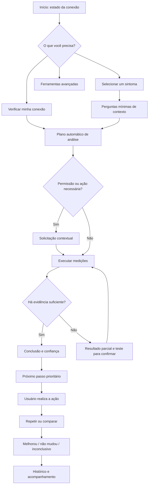

# Jornada Android guiada — SignallQ 2.0

## 1. Status e objetivo

Esta especificação define a arquitetura futura da jornada principal do aplicativo Android. Ela não
descreve a navegação atualmente implementada e não autoriza uma migração direta sem protótipo,
decomposição técnica e revisão.

O objetivo é fazer o SignallQ conduzir a pessoa desde um sintoma cotidiano até uma orientação
verificável, sem exigir que ela conheça ou procure ferramentas de rede.

> **Problema → análise adequada → conclusão simples → próximo passo → confirmação.**

## 2. Evidência do estado atual

Hoje o aplicativo:

- inicia na aba **Velocidade** (`selectedTab = 1` em `AppShell.kt`);
- possui cinco abas: Início, Velocidade, Sinal, Histórico e Ferramentas;
- distribui destinos secundários numa pilha de dezesseis overlays;
- oferece oito ferramentas no hub Ferramentas;
- disponibiliza sete objetivos orientados por sintomas em `ObjetivoDiagnostico`;
- só abre o diagnóstico guiado depois de existir resultado de speed test em memória.

O domínio necessário para a nova entrada já existe parcialmente. Esta proposta reaproveita
`ObjetivoDiagnostico`, `PerguntasDiagnosticoGuiado` e o motor canônico de diagnóstico. Não deve ser
criado um segundo catálogo de sintomas ou motor concorrente.

## 3. Decisão de produto

### 3.1 A unidade principal deixa de ser a ferramenta

A jornada não começa perguntando se o usuário quer Speed Test, Ping, DNS ou Sinal. Começa pelo que
ele percebe ou pelo desejo de verificar a conexão.

As ferramentas passam a ser capacidades convocadas pelo orquestrador da jornada conforme:

- sintoma selecionado;
- tipo de conexão ativa;
- permissões disponíveis;
- dados recentes ainda válidos;
- resultados inconclusivos que exigem confirmação;
- limitações do aparelho ou da rede.

### 3.2 O aplicativo abre em Início

O cold start deve abrir em **Início**, não em Velocidade. A tela apresenta o estado conhecido da
conexão e o CTA principal **Analisar minha conexão**.

### 3.3 O produto oferece dois caminhos claros

1. **Análise guiada:** caminho principal para o público não técnico.
2. **Ferramentas:** acesso secundário para quem sabe o que deseja executar.

Os dois caminhos usam os mesmos motores e componentes. Ferramentas não mantêm lógica diagnóstica
paralela.

## 4. Arquitetura de navegação proposta

### 4.1 Navegação principal

Proposta inicial de três destinos persistentes:

| Destino | Responsabilidade |
|---|---|
| **Início** | Estado atual, entrada pela necessidade, análise recomendada e continuidade |
| **Histórico** | Resultados anteriores, comparações, relatórios e evolução |
| **Mais** | Ferramentas avançadas, monitoramento, ajustes, ajuda, privacidade e sobre |

**Decisão a validar no protótipo:** usar barra inferior com três destinos ou manter dois destinos e
menu de conta. A especificação não fecha o componente antes de validar o wireframe.

Velocidade e Sinal deixam de ser destinos persistentes. Continuam acessíveis como etapas da análise
e ferramentas avançadas.

### 4.2 Fluxos profundos

Análise, perguntas, execução, resultado, orientação e confirmação formam um fluxo empilhado com
retorno previsível. Não devem ser tratados como overlays independentes sem relação explícita.

Sheets são reservadas a escolhas ou detalhes breves. Uma etapa que muda o objetivo principal ocupa
uma tela, não uma modal.

### 4.3 Continuidade

Se uma análise for interrompida por encerramento do app, perda de rede ou permissão, o Início deve
oferecer **Continuar análise** enquanto o contexto ainda for válido.

## 5. Mapa da jornada

## 6. Entrada por necessidade

### 6.1 Pergunta principal

> **O que está acontecendo com sua internet?**

A linguagem final será validada no protótipo. A entrada não deve parecer questionário longo nem
chat.

### 6.2 Opções canônicas

Reaproveitar os objetivos existentes, reorganizados para escaneabilidade:

| Opção apresentada | Objetivo existente | Observação |
|---|---|---|
| **Quero verificar minha conexão** | Entrada neutra | Executa triagem automática sem assumir um sintoma |
| **A internet cai ou oscila** | `INTERNET_CAI_OSCILA` | Mantém domínio atual |
| **Vídeos ou chamadas travam** | `VIDEOS_TRAVAM` / `CHAMADAS_CONGELAM` | A UI pode agrupar; o motor preserva objetivos distintos quando necessário |
| **Jogos estão com lag** | `JOGOS_COM_LAG` | Pode continuar no Modo gamer quando aplicável |
| **Sites demoram para abrir** | `SITES_DEMORAM` | Pode convocar DNS e latência |
| **A velocidade parece baixa** | `VELOCIDADE_NAO_CHEGA` | Evitar prometer comparar plano sem dado contratado |
| **Não sei onde está o problema** | `WIFI_VS_OPERADORA` | Caminho assistido de isolamento |

**Regra:** a camada visual não pode duplicar estes objetivos em outro enum com regras próprias. Se
a UI agrupar opções, deve mapear explicitamente para o domínio existente.

## 7. Plano de análise

Depois da escolha, o produto mostra uma frase curta explicando o que será verificado. Não apresenta
uma checklist técnica completa por padrão.

Exemplo:

> Vamos verificar a estabilidade da conexão e como ela se comporta quando fica ocupada.

O plano é montado a partir de capacidades, não de telas:

| Capacidade | Quando pode ser convocada |
|---|---|
| Estado da conexão | Sempre; rede ativa, offline, Wi-Fi ou móvel |
| Latência e variação | Triagem geral, quedas, chamadas, jogos e sites lentos |
| Download e upload | Velocidade baixa, vídeo, chamadas ou triagem completa |
| Comportamento sob carga | Travamentos durante uso simultâneo ou jogos |
| Sinal Wi-Fi | Sintoma por cômodo, oscilação ou suspeita de rede local |
| Canais Wi-Fi | Interferência e congestionamento, quando suportado |
| DNS | Sites demorando ou resolução suspeita |
| Rede móvel | Sintoma em dados móveis e permissões disponíveis |
| Dispositivos | Uso simultâneo ou investigação de rede local |
| Equipamento de internet | Suspeita de fibra, gateway ou disponibilidade de integração |

## 8. Telas e responsabilidades

### 8.1 Início

**Objetivo:** dizer o que o app sabe agora e iniciar/continuar a ação mais útil.

Conteúdo prioritário:

- conexão ativa em linguagem simples;
- estado conhecido ou “Ainda não analisada”;
- CTA **Analisar minha conexão**;
- continuidade de análise interrompida;
- último resultado relevante, se ainda fizer sentido;
- entrada compacta **Está enfrentando algum problema?**.

Evitar:

- grade de métricas;
- catálogo completo de ferramentas;
- múltiplos cards concorrentes;
- texto institucional;
- CTA roxo em cada seção.

### 8.2 Seleção do sintoma

**Objetivo:** escolher rapidamente o problema percebido.

- Lista visual simples, não grid de cards idênticos.
- Ícones Material ajudam a escanear, sem círculos coloridos obrigatórios.
- Uma frase por opção; subtítulo somente quando evitar ambiguidade.
- Seleção leva diretamente ao contexto mínimo ou plano de análise.

### 8.3 Contexto mínimo

**Objetivo:** obter somente a informação que realmente altera o diagnóstico.

- Uma pergunta por tela ou bloco claramente sequencial.
- Opções fechadas; sem chat livre como padrão.
- Mostrar progresso apenas se houver mais de uma etapa real.
- Pular perguntas respondidas por dados confiáveis do aparelho.
- Não perguntar algo que não muda motor, recomendação ou confiança.

### 8.4 Preparação

**Objetivo:** solicitar permissão ou ação necessária no momento em que seu benefício é evidente.

Exemplos:

- conectar ao Wi-Fi;
- aproximar-se do roteador;
- permitir leitura de redes próximas;
- confirmar uso de dados móveis;
- pausar downloads para obter comparação confiável.

Permissão recusada não encerra a jornada: o plano se adapta e informa o limite.

### 8.5 Análise em andamento

**Objetivo:** mostrar progresso compreensível sem expor complexidade interna.

- Uma visualização dominante.
- Etapa atual em linguagem humana: “Verificando o tempo de resposta”.
- Resultado parcial aparece somente quando ajuda a criar confiança.
- Cancelamento preserva o que já foi medido quando tecnicamente válido.
- Transições Material nativas; sem animação de “IA pensando”.

### 8.6 Resultado

**Objetivo:** responder “o que está acontecendo?”.

Ordem:

1. conclusão curta;
2. consequência para o uso relatado;
3. causa provável;
4. confiança ou limite;
5. próximo passo;
6. detalhes técnicos expansíveis.

O resultado não deve abrir com Mbps, gauge ou tabela.

### 8.7 Orientação

**Objetivo:** recomendar a ação de maior impacto e menor risco.

- Uma ação principal.
- Explicar brevemente por que ela foi escolhida.
- Ações alternativas ficam secundárias.
- Ação externa deve informar o que o usuário fará fora do app.
- Mudanças avançadas em roteador não são apresentadas sem contexto e reversibilidade.

### 8.8 Confirmação

**Objetivo:** verificar se a recomendação resolveu ou reduziu o problema.

- CTA **Testar novamente** associado à mesma análise.
- Comparar condições equivalentes quando possível.
- Resultado: melhorou, não mudou ou comparação inconclusiva.
- Se não melhorou, avançar para a próxima hipótese sustentada por evidência.

### 8.9 Detalhes técnicos

**Objetivo:** oferecer transparência e profundidade sem bloquear o público principal.

- Métricas, método, timestamp, conexão e limitações.
- Compartilhamento ou relatório quando aplicável.
- Não repetir a mesma conclusão em múltiplos cards.

### 8.10 Histórico

**Objetivo:** acompanhar análises e comparar mudanças, não apenas listar speed tests.

Cada item deve priorizar:

- situação ou objetivo analisado;
- conclusão;
- data e contexto da conexão;
- estado da recomendação/confirmacão;
- acesso a métricas e relatório.

### 8.11 Mais

**Objetivo:** concentrar acesso avançado e administrativo.

Grupos sugeridos:

- **Ferramentas de rede:** Ping, DNS, Sinal Wi-Fi, Dispositivos, Equipamento e Modo gamer;
- **Acompanhamento:** Monitoramento e relatórios;
- **Aplicativo:** Ajustes, privacidade, ajuda, termos e sobre.

O nome final e a estrutura serão validados no protótipo. Não usar cards para todas as linhas.

## 9. Estados globais

| Estado | Comportamento esperado |
|---|---|
| Primeira abertura | Explica o benefício em no máximo uma tela antes da entrada guiada |
| Sem análise anterior | Início ensina o CTA principal, sem caixa vazia genérica |
| Offline | Explica o que foi detectado e oferece análises locais disponíveis |
| Rede móvel | Adapta capacidades e avisa consumo antes de transferência relevante |
| Wi-Fi sem internet | Prioriza diagnóstico local; não tenta speed test indefinidamente |
| Permissão negada | Continua com capacidade reduzida e mostra como liberar depois |
| Medição contaminada | Não produz causa definitiva; orienta repetição comparável |
| Resultado parcial | Mostra o que foi possível concluir e o teste necessário para avançar |
| Inconclusivo | Declara insuficiência de evidência e oferece próximo teste |
| Análise interrompida | Permite continuar ou descartar com clareza |
| Funcionalidade remota indisponível | Adapta o plano e evita rota quebrada |
| Erro transitório | Preserva contexto e permite tentar novamente |

## 10. Descoberta de capacidades

O usuário aprende o que o SignallQ faz durante a resolução do problema:

- recomendações podem abrir a ferramenta adequada já contextualizada;
- o resultado explica qual dimensão foi analisada;
- a área Mais mantém o catálogo completo para exploração voluntária;
- Início pode sugerir uma capacidade somente quando houver relação com o contexto atual;
- onboarding não deve listar todas as ferramentas como apresentação comercial.

## 11. Movimento e comportamento nativo

- Entrada em etapa seguinte: shared axis horizontal ou transição de navegação equivalente.
- Voltar: movimento inverso e preservação do estado anterior.
- Item que abre detalhe: container transform quando tecnicamente apropriado.
- Troca de conteúdo no mesmo nível: fade through.
- Sheets somente para decisões breves ou detalhes auxiliares.
- Feedback de toque via ripple e háptico nos momentos de confirmação.
- Transições entre 150 e 300 ms na maioria dos casos; até 400 ms para transformação estrutural.
- Respeitar redução de movimento.
- Nenhuma animação decorativa de carregamento associada à IA.

## 12. Telemetria necessária antes da implementação

Os eventos devem ser especificados com `/analytics-spec` antes do código. O funil mínimo a medir é:

1. entrada da análise;
2. objetivo selecionado;
3. plano iniciado;
4. permissão/ação bloqueante;
5. análise concluída, parcial ou abandonada;
6. recomendação exibida;
7. ação recomendada iniciada;
8. confirmação/reteste;
9. melhora percebida ou medida.

Não incluir conteúdo sensível, SSID, IP, descrição livre ou respostas que identifiquem a pessoa sem
necessidade e revisão de privacidade.

## 13. Critérios de aceite da arquitetura

- [ ] O cold start abre em Início, não em Velocidade.
- [ ] O CTA principal inicia análise sem exigir escolha de ferramenta técnica.
- [ ] Os sete objetivos existentes são reutilizados ou mapeados explicitamente, sem motor paralelo.
- [ ] Perguntas são feitas somente quando alteram diagnóstico, recomendação ou confiança.
- [ ] Cada análise termina em conclusão compreensível ou declaração honesta de insuficiência.
- [ ] Toda conclusão oferece um próximo passo concreto.
- [ ] O usuário consegue repetir e comparar depois da ação.
- [ ] Métricas permanecem acessíveis em detalhes.
- [ ] Ferramentas avançadas continuam disponíveis numa área secundária.
- [ ] Permissão negada, offline, parcial, contaminado e inconclusivo têm continuidade útil.
- [ ] Navegação e movimento seguem padrões Android/Material 3.
- [ ] A camada principal evita grids de cards, excesso de pills e múltiplos CTAs roxos.
- [ ] Telemetria do novo funil é especificada antes da implementação.
- [ ] Protótipo claro/escuro é aprovado antes da alteração de código.

## 14. Questões para o protótipo

Estas decisões devem ser tomadas visualmente, não apenas em texto:

1. Barra inferior com três destinos ou navegação ainda mais compacta?
2. Sintomas abrem em tela própria ou seção progressiva no Início?
3. Como representar estado “ainda não analisado” sem card vazio?
4. Como mostrar confiança sem porcentagem falsa ou pill decorativa?
5. Qual visual dominante substitui o velocímetro na análise geral?
6. Como comparar “antes e depois” com pouco texto?
7. Como a área Mais acomoda ferramentas sem virar dashboard técnico?

## 15. Próximas etapas

1. Produzir wireframes da jornada principal.
2. Validar arquitetura e microcopy com Luiz.
3. Criar protótipo visual claro e escuro usando o Design System 2.0.
4. Inventariar componentes atuais: manter, adaptar, consolidar ou remover.
5. Especificar telemetria do novo funil.
6. Decompor migração técnica em fatias independentes e reversíveis.
7. Implementar com gate de revisão de Caio.

## 16. Fontes relacionadas

- [`../POSICIONAMENTO_PRODUTO.md`](../POSICIONAMENTO_PRODUTO.md)
- [`../design-system/SIGNALLQ_DESIGN_SYSTEM_2_SPEC.md`](../design-system/SIGNALLQ_DESIGN_SYSTEM_2_SPEC.md)
- [`../FUNCIONAL.md`](../FUNCIONAL.md) — comportamento Android atualmente implementado.
- [`DIAGNOSTICO_GUIADO_MODO_GAMER_SPEC.md`](DIAGNOSTICO_GUIADO_MODO_GAMER_SPEC.md) — fluxo guiado
  existente que esta proposta antecipa e reorganiza.

